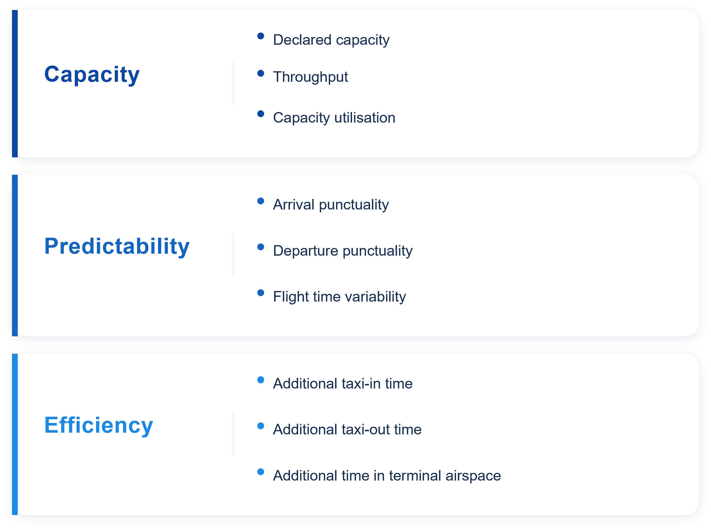

# Executive Summary {.unnumbered}

The Performance Section of the Brazilian Department of Airspace Control (DECEA) and the Performance Review Unit (PRU) of EUROCONTROL jointly developed this edition of the Brazil–Europe comparison of Air Navigation System performance. 
This bi-regional report builds on previous comparative analyses and is based on commonly agreed performance metrics and definitions, enabling a consistent assessment of air navigation service performance over time. By extending the observation period to 2019–2025, the report supports a comprehensive analysis of long-term performance trends, encompassing the pre-COVID, the pandemic disruption, and the subsequent recovery phase. [To be reviewed] 
This report and previous editions are available via the web-portals of both organisations: 

* <https://ansperformance.eu/global/brazil> or 
* <https://performance.decea.mil.br/>.

This edition expands on the previous comparisons of the Brazilian and European air navigation systems by focussing on the observed performance post COVID, extending the time frame, and incorporating additional analyses.
For example, a more detailed characterisation of the Brazilian and European network is included.
With the recent deployment of point-merge, operations at Sao Paulo Guarulhos and Lisbon are studied and an initial characterisation is provided.
On the center level, this edition also looks into comparing Curitiba and Lisbon ACC.
These focussed topics allow to address discussions about performance benefits and may help to highlight the differences between the operations in both regions.

The report focuses on a subset of the eleven Key Performance Areas identified by the ICAO Global Air Navigation Plan, in particular Predictability, Capacity and Efficiency.

```{r}
#| label: fig-scope-KPAs-KPIs
#| fig-cap: Key Performance Areas addressed in this edition
#| out-width: "90%"


```

The comparison shows similarities and differences in the air navigation service provision and observed performance in both regions. 
Major take-aways of this report include:

* The close collaboration between DECEA and EUROCONTROL is highlighted sharing insights and experiences with the international aviation communities, thus assisting in advancing ATM performance management worldwide.
* While the observed performance levels in both regions differ, similarities and understood differences support more targeted discussions on operational concepts. With Europe closing in on pre-pandemic traffic levels and Brazil now consistently observing demand above the pre-pandemic level, this edition also forms the reference for future iterations.
* Regarding punctuality, unique trends were evident in both regions, not solely attributable to the extent of traffic resurgence. In Brazil, a consistently higher proportion of flights arrived significantly early, a pattern largely unaffected when comparing previous years. Conversely, the documented challenges of European airports in coping with the recovering traffic demand and the record high of network constraints in 2023 and 2024 impact the robustness of the schedule.
* Overall, Europe showed a higher level of throughput as the higher traffic numbers and constraints require a higher level of pressure on the infrastructure. Nonetheless, the constraints of reaching pre-pandemic traffic levels will require attention in terms of increasing efficiency and reducing capacity constraints with future growth.
Brazil may benefit from increasing their stance and maintaining current performance levels with the anticipated growth of traffic.
* This report took a first stab at characterising the regional networks for future topic-centric amendments. This will allow to drive future topic studies and provide essential context.
As an initial topic-related study, a closer look was taken at two point merge implementations in Brazil and Europe that show different performance outcomes. This is complemented by providing a first look at the operational context of two centres, i.e., Curitiba and Lisbon. This edition helped to frame the work and identify a set of future research questions.

```{=html}
<!-- last edition findings 
• The difference between Brazil’s and Europe’s systems reacting to the seasons became
more evident during the pandemic recovery. When not hit by another COVID-19
wave, the European region had greater variations in demand between the winter
and summer seasons. The Brazilian flow recovered more gradually, showing a more
continuous demand.
• Predictability in both systems degraded during and post COVID phase and is slowly
recovering to pre-COVID-19 levels.
• Airport runway system capacities in both systems are designed to meet the traffic
levels. Capacities at the Brazilian airports were increased in light of a change of
methodology to determine these capacities and changed procedures.
• The European system showed a higher association between lower demand and
increased efficiency considering additional taxi time, additional time in terminal
airspace and flight time variability. Taxi performance in Brazil follows similar
principles and operational procedures with no significant differences. The partial
analysis of additional time in terminal airspace revealed that on average traffic
in Brazil observed higher times during the arrival phase in 2021 suggesting a
system-wide change. The level of variability of flight times reflected the overall
trend.
• An initial approach to quantifying the emission benefit pool on the basis of the
observed additional taxi-times was developed. Emissions and the improvement pool
- next to operational constraints and inefficiencies - are dependent on the fleet mix
operated at the different airports. This includes the role of the airport within the
respective system. Larger hubs with a higher share of traffic - and in particular
heavy aircraft operations - showed a higher contribution to the overall emission
benefit pool.
---------------------         -->
``` 

This report will be updated throughout the coming years under the umbrella of the DECEA-EUROCONTROL memorandum of cooperation. 
It is also planned to establish a web-based rolling monitoring updated on a regular basis.

Future editions will complement the data time series and support the development of further use-case analyses. 
The lessons learnt of this joint project will be coordinated with the multi-national Performance Benchmarking Working Group (PBWG) and the ICAO GANP Study sub-group concerned with the further development of the GANP Key Performance Indicators (KPIs).
