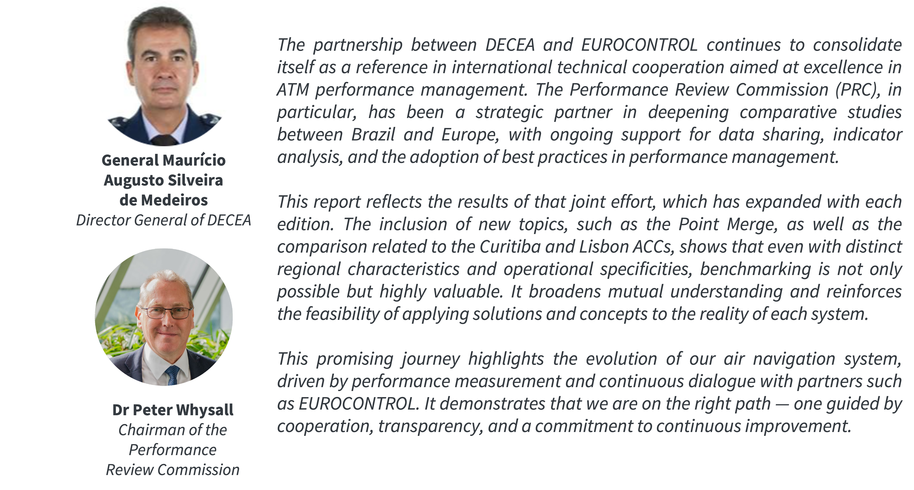

# Foreword {.unnumbered}

<!--

-->

:::{.callout-note} 

**DECEA**

### Final Version 

This publication marks the fifth edition of the collaborative performance report between DECEA and EUROCONTROL - an important milestone that reflects the strength and maturity of our partnership. Building on previous editions, this report expands the airport sample, deepens the analysis of key performance indicators, and introduces, for the first time, a study on horizontal flight efficiency. Together, these advancements consolidate the report as a valuable tool to support data-driven decision-making, promote sector modernization, and foster continuous improvement in air navigation operations. We hope this initiative continues to inspire collaboration not only between Brazil and Europe, but across the global aviation community.

**EUROCONTROL**

### Proposal 1

Five editions in, the Brazil–EUROCONTROL comparative performance report stands as a testament to what sustained institutional commitment can achieve. This edition raises the bar further by expanding the number of airports under analysis and introducing flight efficiency studies alongside our established performance indicators. EUROCONTROL is proud to continue this journey with DECEA and looks forward to the new conversations this fifth edition will inspire.

### Proposal 2

As this joint work continues to evolve, the report offers an increasingly comprehensive and refined view of performance, with greater depth in the analysis of key indicators and an expanded set of airports under observation. The incorporation of flight efficiency studies broadens the technical scope of this edition and reinforces its value as a reference for benchmarking, identification of best practices, and the continuous improvement of Air Navigation System performance across both regions.

:::

<!--
#| label: shakehands
#| fig-cap: ""
#| fig-align: "center"
#| out-width: 55%
knitr::include_graphics("./figures/DGCEA-PRC.jpg")
-->

