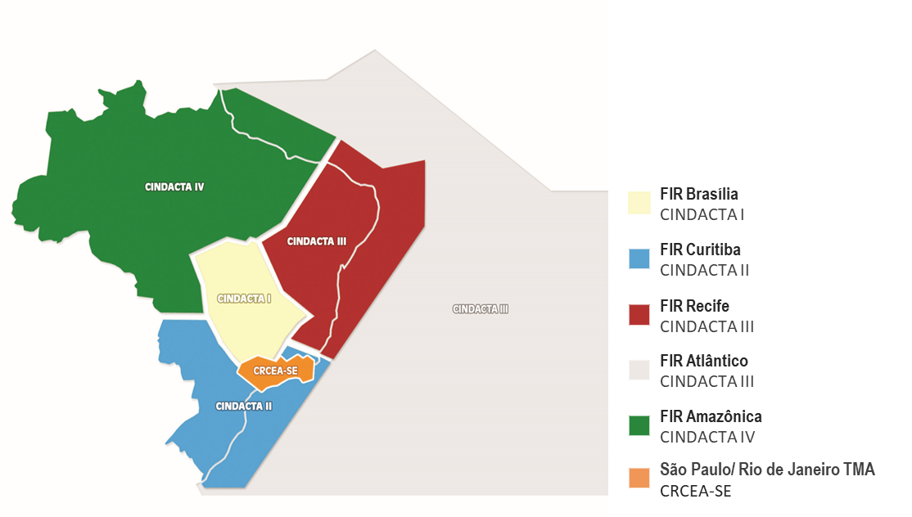
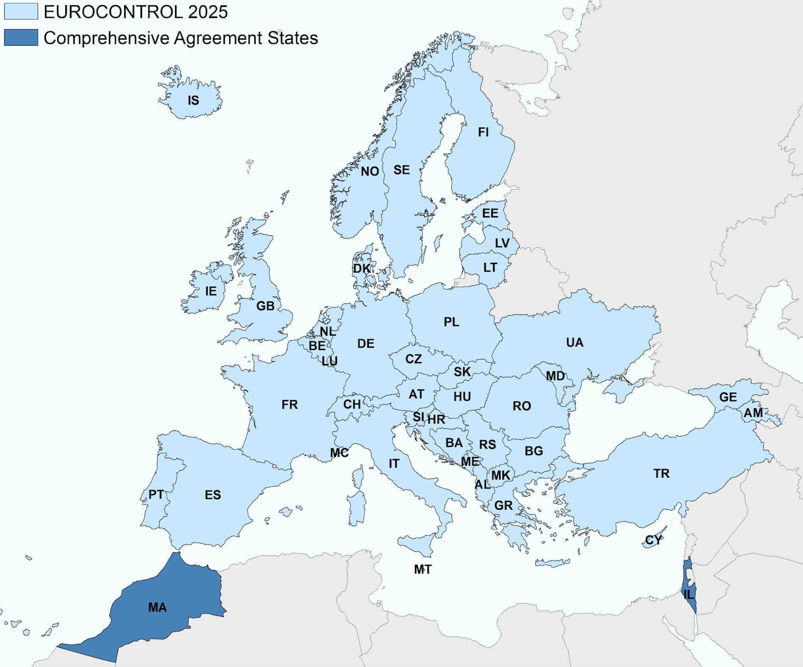
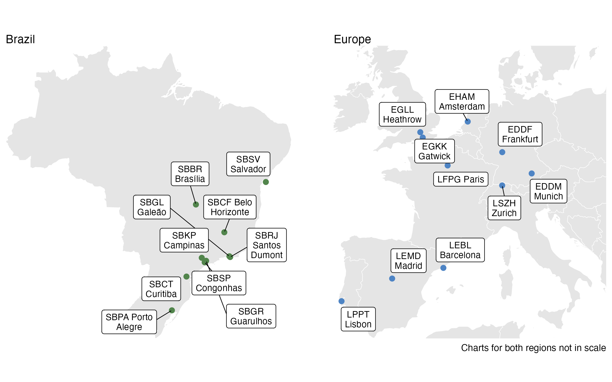

\pagenumbering{arabic}
\setcounter{page}{1}

# Introduction

```{r}
source("_chapter-setup.R")
```

## Background

Air transportation is a key economic driver in Brazil and Europe.
Both regions share the political goal of a performance-based approach to foster the continual growth and efficiency of air transport.
It is recognised that Air Navigation Services (ANS) play a critical role in terms of limiting the constraints on airspace user operations.
Accordingly, the analysis and regional comparison of operational ANS performance informs about trends over time, the success of change implementation, and potential performance benefit pools for future exploitation.

With a view to a tighter collaboration between Brazil and Europe, DECEA and EUROCONTROL signed a cooperation agreement in 2015.
This agreement encompasses various activities, most notably the cooperation and joint initiatives in the domain of operational performance benchmarking of ANS.

The close technical collaboration of the Performance Section of DECEA and EUROCONTROL's Performance Review Unit comprises the further development and validation of proposed ICAO GANP indicators, regular performance related data exchange, and the production of regional or multi-regional performance reports.
An essential part of this work entails the identification and validation of comparable data sources, the development of a joint data preparatory process, and supporting analyses to produce this report or contribute to the aforementioned international activities.   
This report represents the fourth edition of a jointly developed comparison report providing insights into the observed operational performance in Brazil and Europe.

## Performance Areas

Establishing a set of shared definitions and a mutual understanding is essential to facilitate comparisons and operational benchmarking activities.
Therefore, the work presented in this report is rooted in prior work conducted by ICAO, other regional or multi-regional operational benchmarking initiatives (e.g., PBWG [^01-intro-1]), and practices within various regional or organisational settings.

[^01-intro-1]: The Performance Benchmarking Working Group (PBWG) comprises participants from Brazil (DECEA), China (CAA-OSC), Japan (JCAB), Singapore (CAA), Thailand (AEROTHAI), United States (FAA-ATO), and EUROCONTROL.

The key performance indicators (KPIs) utilised in this study have been developed through a rigorous process that integrates the best available data from both the DECEA Performance Section and PRU.
It is important to note that the comparative analysis in this iteration of the report does not encompass all eleven Key Performance Areas (KPA) as presented in @fig-scope-KPAs-KPIs.

From an indicator perspective, the DECEA Performance Section and PRU have reached a consensus to concentrate on operational benchmarking and aligning their efforts with the performance indicators proposed by ICAO in conjunction with the update of the Global Air Navigation Plan (GANP).
Discussions are on-going, and future work may also include aspects of cost-effectiveness.

<!-- The report also presents an initial approach to quantifying potential inefficiencies in terms of fuel burn and CO2 emissions. -->

## Geographical Scope

This report's geographical focus encompasses Brazil and Europe.

Airspace control in Brazil is a fully integrated civil-military operation.
The Brazilian Air Force is responsible for air defence and air traffic control functions.
This ensures air traffic safety while contributing to military defence efforts.
Within this framework, the Department of Airspace Control (DECEA) operates as a governmental entity under the authority of the Brazilian Air Force Command.
DECEA plays a pivotal role in coordinating and furnishing human resources and technical equipment to all air traffic service units operating within the Brazilian territory.

DECEA is the cornerstone of the Brazilian Airspace Control System (SISCEAB).
The department provides air navigation services for the vast airspace jurisdiction covering 22 million square kilometres, including oceanic areas.
The Brazilian airspace is further divided into five Flight Information Regions (FIR) and the areas of responsibility of these integrated Centres for Air Defence and Air Traffic Control (CINDACTA) are depicted in @fig-BRA-airspace.

```{r}
#| label: fig-BRA-airspace
#| fig-cap: Brazilian Airspace Structure/FIRs (CINDACTAs)


```

The CINDACTAs merge civilian air traffic control with military air defence operations.
In addition to the CINDACTAs, there's the Regional Center of Southeast Airspace Control (CRCEA-SE).
The latter is tasked with managing air traffic in the densely congested terminal areas of São Paulo and Rio de Janeiro.

```{r}
#| label: fig-EUR-airspace
#| fig-cap: European Airspace and EUROCONTROL Member States
#| out-width: 90%


```

In this report, Europe, i.e. the European airspace, is defined as the area where the 42 EUROCONTROL member states provide air navigation services, excluding the oceanic areas and the Canary islands (c.f. @fig-EUR-airspace).
In 2016, EUROCONTROL signed a comprehensive agreement with Israel and Morocco.
Both comprehensive agreement States will successively be fully integrated into the working structures of EUROCONTROL, including performance monitoring, in the coming years.
Within this report, these states are included in the reported network traffic volumes.

EUROCONTROL is an inter-governmental organisation working towards a highly harmonised European air traffic management system.
In general, air traffic services are provided by - predominantly national or local - air navigation service providers entrusted by the different EUROCONTROL member states.
Dependent on the local and national regimes, there is a mix of civil and military service providers, and integrated service provision.    
The Maastricht Upper Area Control Center is operated by EUROCONTROL on behalf of 4 States (Netherlands, Belgium, Luxemburg, and Germany).
It is the only multi-national cross-border air traffic service unit in Europe at the time being.
Across Europe a number of cross-border arrangements are in place. 
Given the European context and airspace structure, the European area comprises 37 ANSPs with 62 en-route centres and 16 stand-alone Approach Control Units (i.e. totalling 78 air traffic service units).

Europe employs a collaborative approach to managing and servicing airspace and air traffic.
This includes the integration of military objectives and requirements which need to be fully coordinated within the ATM System.
A variety of coordination cells/procedures exists between civil air traffic control centres and air defence units reflecting the local practices.
Many EUROCONTROL member states are members of NATO and have their air defence centres / processes for civil-military coordination aligned under the integrated NATO air defence system.

Further details on the organisation of the regional air navigation systems in Brazil and Europe will be provided in Section 2.1.

### Study Airports

As concerns airport-related operational air navigation performance, this edition of the comparison report addresses the performance at a set of selected airports.
These airports represent the top-10 or most relevant airports in terms of IFR movements in both regions and allow to make meaningful comparisons.\
In Brazil, the selected airports play a significant role for the national and regional connectivity, including the major hubs for international air traffic.
These study airports have consolidated systems and structured processes for data collection in support of this comparison report.\
For the European context, the study airports comprise the busiest airports in several states exhibiting a mix of national, regional, and international air traffic.
These airports are also characterised by varying operational constraints that make them excellent candidates for an international comparison.
All of these airports are subject to the performance monitoring under the EUROCONTROL Performance Review System and provide movement related data on the basis of a harmonised data specification.

@fig-scope-airports provides an overview of the location of the chosen study airports within both regions.
The airports are also listed in @tbl-scopetable.

```{r}
#| label: tbl-scopetable
#| tbl-cap: List of study airports for the Brazil / Europe operational ANS performance comparison

scopetable <- tibble::tribble(
  ~Brazil,                            ~Europe,
  "Brasília (SBBR)",                  "Amsterdam Schiphol (EHAM)",
  "São Paulo Guarulhos (SBGR)",       "Paris Charles de Gaulle (LFPG)",
  "São Paulo Congonhas (SBSP)",       "London Heathrow (EGLL)",
  "Campinas (SBKP)",                  "Frankfurt (EDDF)",
  "Rio de Janeiro S. Dumont  (SBRJ)", "Munich (EDDM)",
  "Rio de Janeiro Galeão (SBGL)",     "Madrid (LEMD)",
  "Belo Horizonte Confins (SBCF)",    "Lisbon (LPPT)",
  "Salvador (SBSV)",                  "Barcelona (LEBL)",
  "Porto Alegre (SBPA)",              "London Gatwick (EGKK)",
  "Curitiba (SBCT)",                  "Zurich (LSZH)",
)

scopetable |> 
  gt::gt()
```

```{r}
#| label: fig-scope-airports
#| fig-cap: Study airports of Brazil/Europe Comparison
#| out-width: 90%

```

### Temporal Scope

This report focuses on the period from January 2019 to December 2024 with a focus on the post-pandemic years.
This report continues to build a timeline with comparable data to be augmented in future editions.

Throughout the report, summary statistics will be given with reference to calendar years of this comparison study unless highlighted specifically.

## Data Sources

The nature of the performance indicator requires the collection of data from different sources.
DECEA Performance Section and PRU investigated the comparability of the data available in both regions, including the data pre-processes, data cleaning and aggregation, to ensure a harmonised set of data for performance comparison purposes.

DECEA mainly uses data from the tower systems of the main airports as a data source for performance studies.
The control tower system collects and provides data for each landing and take-off operation automatically.
This edition blended ANAC (Brazilian CAA) official and public data with DECEA's data to increase precision for specific indicators, adding a pre-processing phase to the data analytical work.
The provided data include such items as the times of operations, gate entry and exit, and flight origin and destination.

Within the European context, PRU has established a variety of performance-related data collection processes.
For this report the main sources are the European Air Traffic Flow Management System (ETFMS [^01-intro-2]) complemented with airport operator reported data.
These sources are combined to establish a flight-by-flight record.
This ensures consistent data for arrivals and departures at the chosen study airports.
The data is collected on a monthly basis and typically processed for the regular performance reporting under the EUROCONTROL Performance Review System and the Single European Sky Performance and Charging Scheme [@apdf_v1_2019].

[^01-intro-2]: Enhanced Traffic Flow Management System

## Structure of the Report

This third edition of the Brazil-Europe comparison report is organised as follows:

-   **Introduction** -- overview, purpose and scope of the comparison report; short description of data sources used;
-   **Air Navigation System Characteristics** -- high-level description of the two regional systems, i.e. areas of responsibility, organisation of ANS, and high-level air navigation system characteristics;
-   **Traffic Characterisation** -- network level and airport level air traffic movements; peak day demand, and fleet composition observed at the study airports;
-   **Predictability** observed arrival and departure punctuality;
-   **Capacity and Throughput** assessment of the declared capacity at the study airports and the observed throughput, including runway system utilisation comparing achieved peak throughput to the declared capacity;
-   **Efficiency** analysis of taxi-in, taxi-out, and terminal airspace operations
-   **Topic Studies** presents a high-level view on the use of point merge operations at two study airports, and a center-level characterisation; and
-   **Conclusions** summary of this report and associated conclusions; and next steps.

