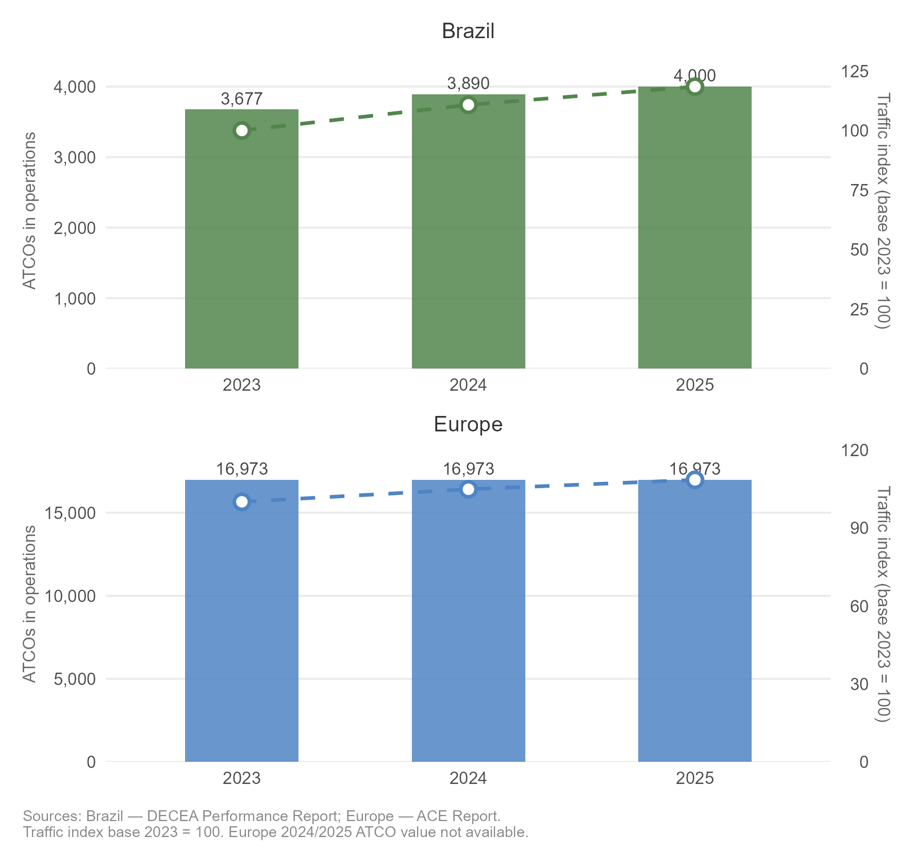
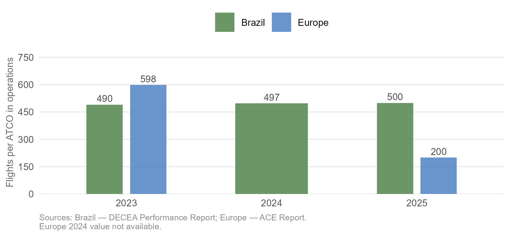
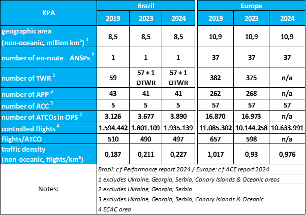
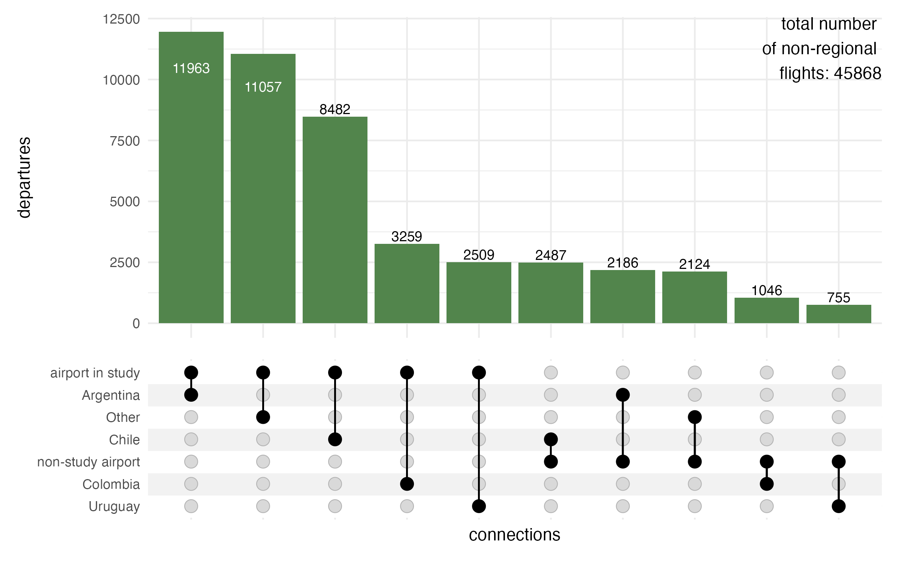

```{r}
source(here::here("_chapter-setup.R"))
#source(here::here("R","02-system_overview-graphs.R"))
```

This section presents key characteristics of the air navigation systems of Brazil and Europe.
In broad strokes, the provision of air navigation services in both regions relies on similar operational concepts, procedures, and supporting technology.
Nonetheless, there are several distinctions between the two systems, which help to account for the similarities and differences in key performance indicators documented in this report.

## Organisation of Air Navigation Services

One of the major differences between the air navigation systems of Brazil and Europe is the respective organisational structure.
In Brazil, a single entity serves as the primary air navigation services provider, i.e. the Department of Airspace Control (DECEA).
In contrast, in Europe, each member state has delegated the responsibility for service provision to either national or local providers.

DECEA holds the vital role of overseeing all activities related to the safety and efficiency of Brazilian airspace control.
Its mission encompasses the management and control of all air traffic within the sovereign Brazilian airspace, with a significant emphasis on contributing to national defence efforts.
To achieve this, DECEA operates a comprehensive and fully integrated civil-military system.

In 2021, a public company, NAV Brasil, was created to take over some facilities that were linked to an older airport infrastructure provider company in Brazil (INFRAERO).
Today, NAV Brasil has xxxx employees in xx different units, providing aerodrome control services, non-radar approach, meteorology and aeronautical information for the respective locations.
Despite serving a significant number of air transport movements, NAV Brasil does not plan to establish radar facilities or provide en-route services.

The Brazilian airspace, covering an area of approximately 22 million square kilometres (8.5 million square nautical miles of non-oceanic airspace), is divided into five Flight Information Regions.
These regions are further subdivided and managed by five Area Control Centers (ACC), xx Tower facilities (TWR), one digital tower (D-TWR), xx Approach Units (APP) and xx AFIS/Remote-AFIS.

The non-oceanic airspace in Europe covers an area of 11.5 million square kilometres.
When it comes to the provision of air traffic services, the European approach involves a multitude of service providers, with 37 distinct en-route Air Navigation Service Providers (ANSPs), each responsible for different geographical regions.
These services are primarily organised along state boundaries and associated FIR borders, with a number of limited cross-border agreements in place between adjacent airspaces and air traffic service units.\
A noteworthy exception to this predominantly national approach is the Maastricht Upper Area Control, which represents a unique multinational collaboration offering air traffic services in the upper airspace of northern Germany, the Netherlands, Belgium, and Luxembourg.

Civil-military integration levels across European countries vary.
Within the European context, the central coordination of Air Traffic Flow Management (ATFM) and Airspace Management (ASM) is facilitated by the Network Manager.
The design of airspace and related procedures is no longer developed and implemented in isolation in Europe.
Inefficiencies in the design and utilisation of the air route network are recognised as contributing factors to flight inefficiencies in the region.
Therefore, as part of the European Union's Single European Sky initiative, the Network Manager is tasked with developing an integrated European Route Network Design.
This is achieved through a Collaborative Decision-Making (CDM) process involving all stakeholders.

Another critical responsibility of the Network Manager is to ensure that air traffic flows do not exceed the safe handling capacity of air traffic service units while optimising available capacity.
To accomplish this, the Network Manager Operations Centre (NMOC) continuously monitors the air traffic situation and proposes flow management measures through the CDM process in coordination with the respective local authorities.
This coordination typically occurs with the local Flow Management Positions (FMP) within the respective area control centres.
Subsequently, the NMOC implements the relevant flow management initiatives as requested by the authorities or FMPs.

## High Level System Comparison

```{r}
#| label: HLC-numbers
# BRA ATCO increase
bra_atco_2019 <- 3126
bra_actos     <- c("2023" = 3677, "2024" = 3890 , "2025" = 4000)
bra_atcos_pct <- ((bra_actos / bra_atco_2019) - 1) * 100
```

@tbl-HLC1 summarises the key characteristics of the Brazilian and European air navigation systems for 2023, 2024, and 2025. The data reflects a period of consolidation and growth in both regions, albeit at different paces and driven by distinct structural factors.


<!---

New table GT

--->

```{r}
#| label: tbl-HLC1
#| tbl-cap: "High Level Comparison 2025-1"
#| output: asis

options(scipen = 999)

note_text <- "Brazil: c.f Performance report 2025 / Europe: c.f ACE report 2024"

hlc_raw <- readr::read_csv2(
  here::here("data", "table_BRA_EUR.csv"),
  col_types = readr::cols(.default = "c")
)

colnames(hlc_raw) <- c(
  "KPA",
  "Brazil_2023", "Brazil_2024", "Brazil_2025",
  "Europe_2023", "Europe_2024", "Europe_2025"
)

if (knitr::is_latex_output()) {

  tbl_latex <- hlc_raw |>
    gt::gt() |>
    gt::tab_spanner(label = "Brazil", columns = c(Brazil_2023, Brazil_2024, Brazil_2025)) |>
    gt::tab_spanner(label = "Europe", columns = c(Europe_2023, Europe_2024, Europe_2025)) |>
    gt::cols_label(
      KPA         = "KPA",
      Brazil_2023 = "2023", Brazil_2024 = "2024", Brazil_2025 = "2025",
      Europe_2023 = "2023", Europe_2024 = "2024", Europe_2025 = "2025"
    ) |>
    gt::cols_align(align = "center", columns = -KPA) |>
    gt::cols_align(align = "left",   columns = KPA) |>
    gt::cols_width(KPA ~ gt::px(220), everything() ~ gt::px(55)) |>
    gt::tab_source_note(source_note = note_text) |>
    gt::tab_style(
      style = gt::cell_text(weight = "bold"),
      locations = gt::cells_body(columns = KPA)
    ) |>
    gt::tab_style(
  style = gt::cell_text(weight = "bold"),
  locations = gt::cells_body(columns = KPA)
    ) |>
    gt::tab_style(
  style = gt::cell_text(size = gt::px(12)),
  locations = gt::cells_body()
    ) |>
    gt::tab_style(
  style = gt::cell_text(align = "center"),
  locations = gt::cells_column_labels(columns = KPA)
) |>
    gt::tab_style(
  style = gt::cell_text(v_align = "middle"),
  locations = gt::cells_body(columns = KPA)
) |> 
    gt::tab_style(
  style = gt::cell_text(align = "center"),
  locations = gt::cells_column_labels(columns = KPA)
) |> 
    gt::tab_options(
      table.font.size       = 14,
      table.width           = gt::pct(100),
      data_row.padding      = gt::px(4),
      column_labels.padding = gt::px(6)
    ) |>
    gt::as_latex()

  tbl_latex <- gsub(
  "\\begin{tabular*}",
  "\\renewcommand{\\arraystretch}{1.6}\n\\begin{tabular*}",
  as.character(tbl_latex),
  fixed = TRUE
)

  cat(tbl_latex)

} else {

  hlc_raw |>
    gt::gt() |>
    gt::tab_spanner(label = "Brazil", columns = c(Brazil_2023, Brazil_2024, Brazil_2025)) |>
    gt::tab_spanner(label = "Europe", columns = c(Europe_2023, Europe_2024, Europe_2025)) |>
    gt::cols_label(
      KPA = gt::html("<div style='text-align:center; padding-bottom:20px;font-size:25px'>KPA</div>"),
      Brazil_2023 = "2023", Brazil_2024 = "2024", Brazil_2025 = "2025",
      Europe_2023 = "2023", Europe_2024 = "2024", Europe_2025 = "2025"
    ) |>
    gt::cols_align(align = "center", columns = -KPA) |>
    gt::cols_align(align = "left",   columns = KPA) |>
    gt::cols_width(
      KPA ~ gt::px(200),
      everything() ~ gt::px(80)
    ) |>
    gt::tab_source_note(source_note = note_text) |>
    gt::tab_style(
      style = gt::cell_text(weight = "bold"),
      locations = gt::cells_body(columns = KPA)
    ) |>
    gt::opt_row_striping() |>
    gt::tab_style(
  style = gt::cell_text(v_align = "middle"),
  locations = gt::cells_body(columns = KPA)
) |> 
    gt::tab_style(
  style = gt::cell_text(align = "center"),
  locations = gt::cells_column_labels(columns = KPA)
) |> 
    gt::tab_style(
  style = gt::cell_text(align = "left"),
  locations = gt::cells_source_notes()
) |> 
    gt::tab_options(
      table.font.size       = 14,
      table.width           = gt::pct(100),
      data_row.padding      = gt::px(8),
      column_labels.padding = gt::px(12)
    )
}

# ============================================================
# Table 2.1: High Level Comparison
# ============================================================
# HOW TO UPDATE THIS TABLE FOR FUTURE YEARS:
#
# 1. Open the file: data/table_BRA_EUR.csv
# 2. Add a new column for the new year (e.g. Brazil_2026, Europe_2026)
# 3. Update the values in each row with the new year's data
# 4. In the code below, add the new column to:
#    - tab_spanner: add Brazil_2026 / Europe_2026 to the columns vector
#    - cols_label: add Brazil_2026 = "2026" / Europe_2026 = "2026"
# 5. To replace a specific value by row name and column name:
#    df[dfKPA == "row name here", "column_name"] <- "new value"
# 6. To find the row and column position of a specific value:
#    which(df == "value_to_find", arr.ind = TRUE)
# 7. To replace a specific value by row and column position:
#    df[row_number, column_number] <- "new value"
# 8. After fixing values, overwrite the original CSV file:
#    readr::write_csv(df, here::here("data-src", "table_BRA_EUR.csv"))
# ============================================================

```


In Brazil, the number of Air Traffic Controllers (ATCOs) in operations has continued to grow steadily, increasing from `r hlc_raw |> dplyr::filter(KPA == "number of ATCOs in OPS") |> dplyr::pull(Brazil_2023)` in 2023 to `r hlc_raw |> dplyr::filter(KPA == "number of ATCOs in OPS") |> dplyr::pull(Brazil_2025)` in 2025 — a rise of `r round((as.numeric(hlc_raw |> dplyr::filter(KPA == "number of ATCOs in OPS") |> dplyr::pull(Brazil_2025)) / as.numeric(hlc_raw |> dplyr::filter(KPA == "number of ATCOs in OPS") |> dplyr::pull(Brazil_2023)) - 1) * 100, 1)`%. This growth closely followed the sustained increase in air traffic demand over the same period, reflecting a proactive approach to capacity building in line with the country's continued aviation expansion. This behaviour may be partly explained by the fact that DECEA shares part of the structure used in basic training with other Air Force training processes, which, despite leading to a more centralised and rigid hiring process, has allowed for a consistent pipeline of new controllers to meet growing operational needs.

In Europe, ATCO numbers showed only a mild variation over the period, moving from [X] in 2023 to [X] in 2025. This more conservative modulation reflects not only the slower pace of traffic recovery in the region but also a strategic orientation toward investment in technology, automation, and operational efficiency as levers to absorb demand. In Europe, there exists a mix of organisational models and labour contracts ranging from public service to fully commercial organisation, which tends to produce more measured responses to anticipated changes in air traffic demand. @fig-ATCO illustrates this divergence in workforce evolution alongside the traffic index for both regions.

```{r}
#| label: fig-ATCO
#| fig-cap: "ATCO comparison"
#| fig-align: "center"
#| out-width: 95%


```

The traffic density indicator — expressed as controlled flights per square kilometre of non-oceanic airspace — provides a structural lens through which the operational differences between both regions can be better understood. In 2025, Europe operated at a density of `r hlc_raw |> dplyr::filter(KPA == "traffic density (non-oceanic flights/km²)") |> dplyr::pull(Europe_2025)` flights/km², significantly higher than Brazil's `r hlc_raw |> dplyr::filter(KPA == "traffic density (non-oceanic flights/km²)") |> dplyr::pull(Brazil_2025)` flights/km². Despite this gap, Brazil's density has grown consistently over the period, reflecting the continued expansion of domestic aviation. This contrast underpins many of the operational differences discussed throughout this report, particularly regarding coordination complexity, capacity constraints, and network organisation.

Beyond the absolute number of controllers, the ratio of controlled flights per ATCO in operations offers a complementary perspective on how each system organises its workforce relative to demand. @fig-ATCO-ratio shows that Europe consistently records a higher flights-per-ATCO ratio compared to Brazil. This difference reflects not only the traffic density gap between the two regions but also distinctions in airspace organisation, sector design, and the distribution of responsibilities across control units.


```{r}
#| label: fig-ATCO-ratio
#| fig-cap: "ATCO ratio"
#| fig-align: "center"
#| out-width: 95%


```


<!-- Old text

Comparing the high-level numbers, Brazil observed a steady increase in the number of Air Traffic Controllers (ATCOs) compared to 2019 (e.g. 2023 vs 2019: `r round(bra_atcos_pct[1], 1)`%, 2024 vs 2019: `r round(bra_atcos_pct[2], 1)`%).
In contrast, the European system showed only a mild increase in total ATCOs in service following the strong reduction during the pandemic in terms of work force.


The different behaviour suggests a difference in work force flexibility between the systems.
Brazil reacted swiftly to the increase of air traffic ranging at `r ( ((1935139/1594442) - 1) * 100) |> round(1)`% higher than in 2019.
Europe has seen a mild modulation of ATCO numbers with the annual traffic in 2024 ranging about 4% below the 2019 level.\
This may be partly explained by the fact that DECEA shares part of the structure used in basic training with other Air Force training processes.
This leads to a more centralised and rigid process, in which abrupt reactions in hiring planning are unwanted due to the lengthy process of calling for candidates according to Brazilian laws related to public service jobs.
In Europe, there exists a mix of organisational models and labour contracts ranging from public service to fully commercial organisation.
Thus, European providers tend to react more conservative to anticipated changes in air traffic demand.

Another key difference affecting performance in both regions for this report is the development of air traffic demand.
Unlike in Europe, it is interesting to note that Brazil ended 2022 already servicing air traffic movements above the pre-pandemic level.
There is a continual increase in air traffic in Brazil accounting now for 21,4% of more traffic than in 2019.
<!-- However, as will be shown later, much of this growth was due to the strong increase in general aviation and only to a lower extent in commercial aviation.\  Overall, the volume of air traffic also rebounded in Europe.
At the end of 2023, the level reached about 90% of the pre-pandemic air traffic, and with 2024 the gap is closing to about 96%.
These recovery numbers are impacted by the geo-political developments.
Due to the Russian invasion of Ukraine, a certain share of flights is currently banned to operate to/from Europe.

-->


<!-- Note: this table is imported from powerpoint - check for figures-handmade.pptx in ./figures or the file / data specifically created for this iteration
-->


<!--


#| label: tbl-HLC
#| tbl-cap: High Level Comparison 2024
#| out-width: 95%



-->


Both regions operate with similar operational concepts, procedures, and supporting technology. Considering the non-oceanic dimension of the airspace, Brazil services an area approximately 22% smaller than Europe. Brazil, with lower traffic density relative to its airspace, faces a more challenging cost-benefit ratio in maintaining communication coverage and surveillance for regions with low traffic volumes. The higher traffic density in Europe influences all aspects of flight management — in particular, the European region faces more considerable challenges in coordinating efforts to address operational constraints and service current demand.
The contrast between one single en-route ANSP in Brazil and 37 in Europe is one of the most structurally significant differences between the two systems. This fragmentation is precisely the rationale behind the Network Manager's coordinating role in Europe — ensuring that flow management decisions, route network design, and capacity planning are addressed collectively rather than in isolation. Brazil's unified structure under DECEA allows for more centralised decision-making, which may offer advantages in terms of system-wide responsiveness, though it also places considerable institutional responsibility on a single entity


:::{.callout-warning}

Section Network Characterisation was moved to chapter 03

:::

<!--

## Network Characterisation

To address the changes in air traffic and develop a better understanding of the nature of the air transportation network, this report expands the characterisation of the network.
@ fig-apt-rank-comparison-2024 depicts the cumulative share of departures from airports in both regions.

```{r}
#| label: fig-apt-rank-comparison-2024
#| fig-cap: "Airport Rank Comparison 2024"
#| out-width: 90%
#| message: false
#| 
# funciton - deactivated as it requires 900MB data file 
# ==> side-study == to be completed plot_cumulative_percentage_by_apt_rank()

#comb_deps_routes <- arrow::read_parquet("./data/BRA-EUR-dep-counts-2024.parquet")

comb_deps_routes <- readr::read_csv("./data/BRA-outbound-2019-2025.csv") |> 
  filter(YEAR %in% 2025)


tmp <- comb_deps_routes |> filter(RANK <= 200) |> 
  #------------- patch for missing 0 data ----------------
  rows_append(
    tribble(
        ~ADEP,~DEPS,~REGION, ~RANK, ~SHARE, ~CUM_SHARE
        ,"SXXX", 0, "BRA", 0, 0, 0
        ,"EZZZ", 0, "EUR", 0, 0, 0
        )
    ) |> 
  arrange(REGION, RANK)

tmp_label <- tmp |> filter(RANK %in% c(10,50, 100))

  #---------------- and plot ----------------------------
ggplot() + 
  geom_vline(xintercept = c(10,50, 100), linetype = "dotted") +
  geom_step(data = tmp, aes(x = RANK, y = CUM_SHARE, group = REGION, color = REGION)) +
  #geom_step(data = tmp, aes(x = RANK, y = CUM_SHARE, group = YEAR, color = YEAR)) +
  geom_point(data = tmp_label, aes(x = RANK, y = CUM_SHARE, color = REGION)
             ,show.legend = FALSE) +
  geom_label(data = tmp_label, aes(x = RANK, y = CUM_SHARE, color = REGION
                                   , label = paste0(round(CUM_SHARE * 100), "%"))
             , nudge_x = 8, nudge_y = -0.03
             , show.legend = FALSE) +
  scale_color_manual(values = c(BRA = bra_col, EUR = eur_col)) +
 # scale_y_continuous(labels = scales::percent_format()) +
  labs( x = "airport rank in terms of departures in 2024"
       ,y = "share of regional departures"
       ,color = element_blank()) +
  theme(legend.position = "inside", legend.position.inside = c(0.85, 0.875) )
```


@ tbl-HLC lists the overall serviced traffic in both regions.
In 2024 Brazil observed just under a fifth (18.2%) of the traffic handled in Europe.
With overflights representing a small share of the traffic in both regions, @fig-apt-rank-comparison-2024 focusses on the aerodrome movements considering all observed departures.
The distribution of air traffic in Brazil confirms that most flights are concentrated in a small number of airports.
Traffic in Europe operates from a larger number of aerodromes.
For example, in 2024, the 10 busiest airports in Brazil handled 61% of all departing flights whereas in Europe, the top 10 airports account for 19% of all departures.
The spread in shares remains broadly constant up to the 50th rank of all departures and narrows to 30% with the top 100 airports in both regions.
The latter marking 97% of all departures in Brazil and 67% in Europe.

The latest edition of Brazil’s Annual Performance Report (it can be found on http://performance.decea.mil.br) reflects this reality.
It now includes 100 airport locations instead of only the top 34, ensuring that almost all flights are included in the analysis.
This distribution shows that many aerodromes operate with low traffic volumes.
Because of that, it is important to study alternative ways to provide air traffic services.

In Brazil, the Aerodrome Flight Information Service (AFIS) is an effective strategy to ensure safety at locations where the traffic does not justify the installation of a control tower (TWR).
This service, usually provided via radio telephony only, gives essential information to pilots, helping to use resources efficiently and keeping operations safe.
Since 2016, Brazil has been expanding the use of remote AFIS units (R-AFIS), especially in strategic areas like the Amazon region.
These services are provided from ACCs (Area Control Centers), which means they don’t need dedicated local infrastructure.
Also, in 2024, demand for air traffic services continued to grow.
This shows the need to review and improve how services are organized in Brazil.
Expanding the use of the AFIS model in strategic areas may be a cost-effective and safe way to meet future needs and make better use of SISCEAB’s resources.

The more spread-out distribution in Europe showcases the historical development of the European network.
The traditional focus on national hubs and carriers resulted in the development of a higher number of major aerodromes (typically servicing the capital, major metropoles, or economic centers) interconnecting with other national hubs across the continent.
There exists a mix of the organisation of smaller operations in Europe.
Dependent on the national or local setup, the resources of the national service provider are often complemented by local service providers.
Thus, the provision of services varies between smaller manned towers and remotely provided FIS functions provided by nearby ACCs.
This includes instrument procedures to approach (and depart) from an uncontrolled aerodrome.
Given this mix of organisation and funding in Europe, no consolidated pan-European data was available to specifically account for local AFIS services.
Across Europe, there is an interest in consolidating aerodrome control services at important low frequency sites through the deployment of digital remote tower operations.
This ranges from site specific remote tower operations (e.g. Cork/Ireland) to a multi-remote tower center (e.g. Stockholm/Sweden, Bodo/Norway) servicing multiple airports simultaneously.

While the view on the concentration of air traffic provides first insights, the level of connectivity is not immediately identifiable.

::: {layout-ncol="2"}
```{}
#| label: fig-share-intnl-regional
#| fig-cap: "Share of international and regional/domestic traffic in 2024"
#| 
# load international movement data set for 2024
bra_mvts_intnl <- read_csv("./data/BRA-network-conns-intnl.csv", show_col_types = FALSE) |> mutate(REGION = "BRA")

eur_mvts_intnl <- read_csv("./data/EUR-network-conns-intnl.csv", show_col_types = FALSE) |> mutate(REGION = "EUR") 

calc_group_rankings <- function(
      .dfwithgroup
    , .grp_vars = c("REGION","TYPE","LABEL")
    , .rank_var = DEPS){
  rankings <- .dfwithgroup |>
    dplyr::group_by( dplyr::across( dplyr::all_of(.grp_vars) ) ) |> 
    dplyr::reframe({{ .rank_var }} := sum( .data$DEPS)) |> 
    dplyr::arrange(dplyr::desc({{ .rank_var }})) |> 
    dplyr::mutate( 
        RANK      = dplyr::row_number()
       ,SHARE     = {{ .rank_var }} / sum( {{ .rank_var }})
       ,CUM_SHARE = cumsum(SHARE) 
                  )
  
  return(rankings)  
}

bra_reg_intnl <- bra_mvts_intnl |> 
  rename(TYPE = TFC_TYPE, LABEL = DES_PRU) |> calc_group_rankings() 

eur_reg_intnl <- eur_mvts_intnl |> 
  rename(TYPE = TFC_TYPE, LABEL = DES_PRU) |> calc_group_rankings()

bind_rows(bra_reg_intnl, eur_reg_intnl) |> tidyr::drop_na() |> 
  
  ggplot() + 
  geom_col(aes(x = TYPE, y = SHARE, fill = TYPE)) + 
  facet_wrap(. ~  REGION) +
  scale_y_continuous(labels = scales::percent_format()) +
  labs(x = element_blank(), y = element_blank()) +
  theme(legend.position = "none")
  
```

@fig-share-intnl-regional shows the distribution of regional/domestic and international departures.
For both regions we observe a share of less than 12% of serviced traffic are flights operating to and from the regions.
The majority of flights operate within the region, i.e., within the domestic Brazilian network and conversely the European network spanning across EUROCONTROL Member States.
:::

::: {layout-ncol="2"}
```{}
#| label: fig-share-intnl-regions
#| fig-cap: "Share of destinations in 2024"

subset_international <- function(.intnl_tfc_shares){
  this_subset <- .intnl_tfc_shares |> 
  filter(TYPE %in% "international", !is.na(LABEL)) |> 
  mutate(LABEL = forcats::fct_infreq(LABEL, w = DEPS))
  
  return(this_subset)
}

bind_rows(
   bra_reg_intnl |> subset_international()
  ,eur_reg_intnl |> subset_international()
  ) |> 
  ggplot() + 
  geom_col(aes(x = LABEL, y = SHARE, fill = LABEL)) + 
  scale_y_continuous(labels = scales::percent_format(), limits = c(0, 0.05)) + 
  labs(x = element_blank(), y = element_blank()
       ,fill = element_blank()) + 
  facet_wrap(.~ REGION, scales = "free_x") +
  coord_flip() +
  theme( legend.position = "top", legend.direction = "horizontal"
        ,legend.justification = "left" # left-aligned
        ,legend.key.size = unit(3,"mm")
        )
```

From an international perspective both regions are interconnected differently.
@fig-share-intnl-regions sees a spread of the international traffic to other regions.
Traffic from Brazil to Europe (i.e., Eurocontrol Member States) accounts for just under 2% of the total traffic volume in Brazil.
Connections to other Southern America states represent the major international destinations accounting for about 5%.
Europe has a shallow share of flights going to Southern America, including Brazil.
The Middle East, Northern America, and Africa represent the biggest international markets ranging between 2.3-3.3% of all departures in Europe.
:::

```{r}
#| label: fig-BRA-upset-connection
#| fig-cap: Connections to adjacent countries
#| out-width: 90%


```

With @fig-BRA-upset-connection we observe just under 46.000 flights in 2024 operated to adjacent countries in South America.
A strong segment of the market represents flights to/from Argentina and Chile accounting for about half of the flights departing from the airports in this study.
Accordingly, flights to Colombia and Uruguay from the study airports account for a smaller fraction, and there is a multitude of other connections to South America and the Caribbean.
Flights operating from airports not included in this study account for smaller shares.
This confirms the selection of the study airports for Brazil, as the major airports handle most of the pan-regional traffic with a strong connection to Argentina and Chile.

```{}
#| label: fig-BRA-EUR-connections-parallel
#| fig-cap: Connections between the study regions in 2024
#| fig-height: 7

flows_long <- read_csv(
  here::here("data","BRA-EUR-conns-parallel.csv")
  , show_col_types = FALSE
  ) |> 
  #------ correct for link color ------------
mutate(LINK = ifelse(ORIG_GROUP == "Study" & DEST_GROUP == "Study", "Study", "Non-Study"),.before = ORIG_GROUP)

ggplot(flows_long, aes(x = x, id = id, split = y, value = DEPS)) +
  geom_parallel_sets(aes(fill = LINK), alpha = 0.6, axis.width = 0.1) +
  geom_parallel_sets_axes(axis.width = 0.2, fill = "gray90") +
  geom_parallel_sets_labels(angle = 0, size = 3, colour = "black") +
  scale_x_discrete(labels = c("Origin", "Destination")) +
  scale_fill_manual(values = c("Study" = "blue", "Non-Study" = "lightblue")) +
  theme_minimal() +
  labs(
    # title = "Flight Flows from Europe to Brazil (Study vs Non-Study)",
    # subtitle = "Grouped by Origin and Destination Study Status",
    y = "Number of Departures", x = element_blank(), fill = element_blank()
  ) +
  theme(legend.position = "inside", legend.position.inside = c(0.1,0.1))
```

@fig-BRA-EUR-connections-parallel shows the connections between Europe and Brazil in 2024.
Individual connections of less than 90 flights per year are aggregated into an "other" group.
These largely reflect specific individual flights (e.g. State flights, special cargo operations), and only contribute to a small extent to the overall traffic between both regions.\
Guarulhos (SBGR) and Lisbon (LPPT) are the main airports for connectivity between both regions.
Due to its prominent role, this edition considers operations at LPPT in a more prominent manner.

Future work may highlight to what extent resources within both regions are bound to establishing basic connectivity and what type of services are provided to accommodate the demand.
Further research can explore how both regions can maximise installed capacity, benefit from novel operational or technical concepts, and suggest improvements for ANS provision.

-->

## Regional Approach to Operational Performance Monitoring

The previous report detailed the historic setup of the performance monitoring systems in Brazil and Europe.

The implementation of the performance-based approach is not a fundamental new activity in Europe.
The Performance Review Commission (PRC) was established within EUROCONTROL in 1998 aiming to establish and implement an independent European air traffic management (ATM) performance review capability in response to the European Civil Aviation Conference (ECAC) Institutional Strategy.
The main goal of the PRC is to offer impartial advice on pan-European ATM performance to EUROCONTROL's governing bodies.
Supported by the Performance Review Unit (PRU), the PRC conducts extensive research, data analysis, and consultations to provide objective insights and recommendations.
EUROCONTROL's performance review system, a pioneering initiative in the late 1990s, has influenced broader forums like ICAO's global performance approach and the Single European Sky (SES) performance scheme.
Collaborating internationally, particularly with ICAO, the PRC aims to harmonise air navigation practices.
The PRC produces annual reports (ACE and PRR) and provides operational performance monitoring through various data products and online tools.
Continuous efforts are made to expand the online reporting for stakeholders and ensure access to independent performance data for informed decision-making.

It is noteworthy to recall that DECEA, influenced by ICAO publications, embraced a performance-based approach, notably advancing the national state-of-the-art in collaboration with EUROCONTROL.
Beginning with the SIRIUS Brazil Program in 2012, DECEA faced challenges defining metrics, but made significant progress after signing a Cooperation Agreement with EUROCONTROL in 2015.
DECEA published crucial documents for ICAO's Global Air Navigation Plan, prompting an organisational transformation and adaptation of practices.
Establishing the ATM Performance Section in 2019, akin to EUROCONTROL's PRU, DECEA accelerated the build-up of expertise in operational performance monitoring.
This culminated in the publication of the first Brazilian ATM Performance Plan for 2022-2023.
Actively fostering an open culture of knowledge-sharing within South America, DECEA engaged in workshops and seminars, and inviting EUROCONTROL for collaboration.

Finally, it should be noted that the recurrent use of indicators by EUROCONTROL and DECEA and the close technical collaboration taking place during the analysis periods for joint conclusions enrich not only the two regions but also have a global impact.
Embracing transparency, both agencies made indicators and databases publicly accessible, perpetuating a culture of reciprocity and transparency for mutual advancement.
Looking for broader validation and harmonisation, the lessons learned from this scheme are systematically shared with the multi-national Performance Benchmarking Working Group (PBWG) and the Performance Expert Group of the ICAO GANP Study Group, which deals with the development of GANP Key Performance Indicators (KPIs).
In this respect, this collaboration between both parties serves as a role model for ANS performance management on a global level.

Updated dashboards, previous work, and supporting historical data are available at <https://ansperformance.eu/global/brazil/> or <https://performance.decea.mil.br/>.

## Summary

While both regions operate on similar operational concepts and technologies, there exists key characteristics and distinctions in both regions.
One of the key differences is the overall organisation of air navigation services.
Brazil's air navigation services are centralised under DECEA, overseeing all airspace control and contributing to national defence.
In contrast, Europe's air navigation services are provided by multiple entities and ANSPs operating predominantly within their national state boundaries and FIR borders.

Also remarkable is the comparison of the number of air traffic controllers between Brazil and Europe during the pandemic.
This revealed contrasting trends.
Brazil experienced an increase in ATCOs in line with the overall traffic growth.
ATCO numbers in Europe marginally increased in comparison to 2019 in 2023.
This disparity underscores a significant difference in the systems' responsiveness, partly attributed to Brazil's centralised and rigid hiring process.
At the same time, European providers operate with greater independence with varying organisational setups (public vs private organisation, unions).
Adjustments of the ATCO workforce tend to be more conservative.

The distribution of commercial flights in 2022 indicated that only a subset of airports handled 80% of commercial take-offs.
In 2024 - with the stabilising air traffic levels - the top-10 airports in Europe handled 19% of the network departures, while in Brazil the top-10 accounted for 61%; considering the top-100 airports in both regions, this group handled 67% of all departures in Europe, and 97% in Brazil.
The concentration effect is higher in Brazil than in Europe.
On the other hand, the distribution also showed that a significant number of airports operating commercial flights handle only a marginal share of the movements in both systems.
This duality may inform decision-makers about potential performance benefit pools with a view to allocate scarce ANS resources and capabilities and ensure the proper balancing of demand and capacity.

This report documents the close collaboration between DECEA and EUROCONTROL.
The effort benefits the two regions and contributes globally by sharing insights and lessons learned with international aviation communities, aiding the development of ATM performance management worldwide.
