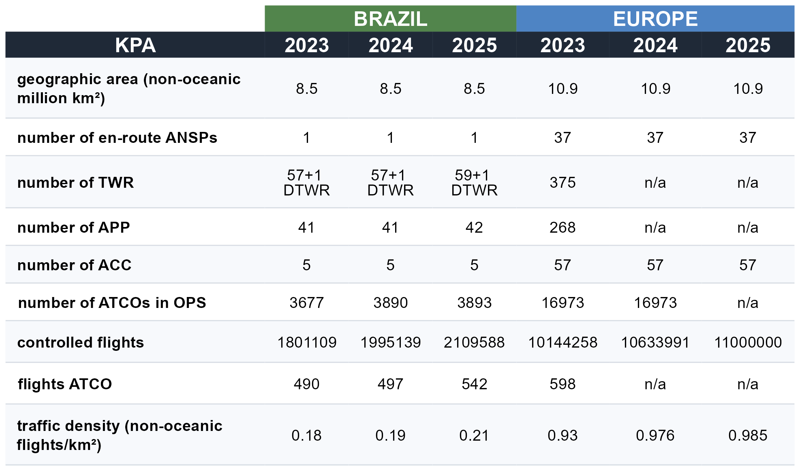

```{r}
source(here::here("_chapter-setup.R"))
#source(here::here("R","02-system_overview-graphs.R"))
```

This section presents key characteristics of the air navigation systems of Brazil and Europe.
In broad strokes, the provision of air navigation services in both regions relies on similar operational concepts, procedures, and supporting technologies.
Nonetheless, there are several distinctions between the two systems, which help to account for the similarities and differences in key performance indicators documented in this report.

## Organisation of Air Navigation Services

One of the major differences between the air navigation systems of Brazil and Europe is the respective organisational structure.
In Brazil, a single entity serves as the primary air navigation services provider, i.e. the Department of Airspace Control (DECEA).
In contrast, in Europe, each member state has delegated the responsibility for service provision to either national or local providers.

DECEA holds the vital role of overseeing all activities related to the safety and efficiency of Brazilian airspace control.
Its mission encompasses the management and control of all air traffic within the sovereign Brazilian airspace, with a significant emphasis on contributing to national defence efforts.
To achieve this, DECEA operates a comprehensive and fully integrated civil-military system.

In 2021, a public company, NAV Brasil, was created to take over some facilities that were linked to an older airport infrastructure provider company in Brazil (INFRAERO).
Today, NAV Brasil <!-- has xxxx employees in xx different units, providing --> provides aerodrome control services, non-radar approach, meteorology and aeronautical information for the respective locations.
Despite serving a significant number of air transport movements, NAV Brasil does not plan to establish radar facilities or provide en-route services.

The Brazilian airspace, covering an area of approximately 22 million square kilometres (8.5 million square nautical miles of non-oceanic airspace), is divided into five Flight Information Regions.
These regions are further subdivided and managed by five Area Control Centers (ACC), `r table_bra_eur |> dplyr::filter(KPA == "number of TWR") |> dplyr::pull(Brazil_2025) |> stringr::str_extract("^\\d+")` Tower facilities (TWR), one digital tower (D-TWR), `r table_bra_eur |> dplyr::filter(KPA == "number of APP") |> dplyr::pull(Brazil_2025)` Approach Units (APP) and 70 AFIS/Remote-AFIS.

The non-oceanic airspace in Europe covers an area of 11.5 million square kilometres.
When it comes to the provision of air traffic services, the European approach involves a multitude of service providers, with 37 distinct en-route Air Navigation Service Providers (ANSPs), each responsible for different geographical regions.
These services are primarily organised along state boundaries and associated FIR borders, with a number of limited cross-border agreements in place between adjacent airspaces and air traffic service units.
A noteworthy exception to this predominantly national approach is the Maastricht Upper Area Control, which represents a unique multinational collaboration offering air traffic services in the upper airspace of northern Germany, the Netherlands, Belgium, and Luxembourg.

Civil-military integration levels across European countries vary.
National souvereignty and defense remain a national responsibility, and civil-military coordination for airspace and flight operations follows a variety of models. 
These range from stand-alone units to fully integrated and jointly operated services.
With most Member States of EUROCONTROL being member of NATO, there is also strong coordination of the military dimension through joint assets and capabilities. 
Within the European context, the central coordination of Air Traffic Flow Management (ATFM) and Airspace Management (ASM) is facilitated by the Network Manager.
The design of airspace and related procedures is no longer developed and implemented in isolation in Europe.
Inefficiencies in the design and utilisation of the air route network are recognised as contributing factors to flight inefficiencies in the region.
Therefore, as part of the European Union's Single European Sky initiative, the Network Manager is tasked with developing an integrated European Route Network Design.
This is achieved through a Collaborative Decision-Making (CDM) process involving all stakeholders.

Another critical responsibility of the Network Manager is to ensure that air traffic flows do not exceed the safe handling capacity of air traffic service units while optimising available capacity.
To accomplish this, the Network Manager Operations Centre (NMOC) continuously monitors the air traffic situation and proposes flow management measures through the CDM process in coordination with the respective local authorities.
This coordination typically occurs with the local Flow Management Positions (FMP) within the respective area control centres.
Subsequently, the NMOC implements the relevant flow management initiatives as requested by the authorities or FMPs.

## High Level System Comparison

```{r}
#| label: HLC-numbers
# BRA ATCO increase
bra_atco_2019 <- 3126
bra_actos     <- c("2023" = 3677, "2024" = 3890 , "2025" = 4000)
bra_atcos_pct <- ((bra_actos / bra_atco_2019) - 1) * 100
```

@tbl-HLC1 summarises the key characteristics of the Brazilian and European air navigation systems for 2023, 2024, and 2025. The data reflects a period of consolidation and growth in both regions, albeit at different paces and driven by distinct structural factors.

<!---
New table GT  == NEED TO CHECK OUTPUT in html vs pdf

--->


::: {#tbl-HLC1 tbl-cap="High Level Comparison 2025"}

{width=90% tbl-pos='H'}

:::


<!-- I think it is cleaner to extract the "facts" below in a separate code-chunk here, introduce a variable, and call it as inline chunk below. 
There is quite some codeing in the inline chunks that makes it difficult to follow. 
-->

In Brazil, the number of Air Traffic Controllers (ATCOs) in operations has continued to grow steadily, increasing from `r table_bra_eur |> dplyr::filter(KPA == "number of ATCOs in OPS") |> dplyr::pull(Brazil_2024)` in 2024 to `r table_bra_eur |> dplyr::filter(KPA == "number of ATCOs in OPS") |> dplyr::pull(Brazil_2025)` in 2025 — a rise of `r round((as.numeric(table_bra_eur |> dplyr::filter(KPA == "number of ATCOs in OPS") |> dplyr::pull(Brazil_2025)) / as.numeric(table_bra_eur |> dplyr::filter(KPA == "number of ATCOs in OPS") |> dplyr::pull(Brazil_2024)) - 1) * 100, 1)`%. 
In Brazil, the number of Air Traffic Controllers (ATCOs) in operations remained broadly stable between 2024 and 2025, rising marginally from 3,890 to 3,893 — an increase of just 0.1%. Despite this near-plateau in workforce size, controlled traffic continued to grow over the same period, suggesting that productivity gains and operational efficiency improvements have played an increasingly important role in sustaining capacity. This trend reflects a broader strategic shift within DECEA, where investments in technological modernisation and process optimisation are enabling the existing controller workforce to handle a growing volume of flights, demonstrating that sustainable growth in air traffic management need not rely solely on workforce expansion.

In Europe, ATCO numbers showed only a mild variation over the period, moving from `r table_bra_eur |> dplyr::filter(KPA == "number of ATCOs in OPS") |> dplyr::pull(Europe_2023)` in 2023 to `r table_bra_eur |> dplyr::filter(KPA == "number of ATCOs in OPS") |> dplyr::pull(Europe_2024)`  in 2024. This more conservative modulation reflects not only the slower pace of traffic recovery in the region but also a strategic orientation toward investment in technology, automation, and operational efficiency as levers to absorb demand. In Europe, there exists a mix of organisational models and labour contracts ranging from public service to fully commercial organisation, which tends to produce more measured responses to anticipated changes in air traffic demand. @fig-ATCO illustrates this divergence in workforce evolution alongside the traffic index for both regions.

```{r}
#| label: fig-ATCO
#| fig-cap: "ATCO comparison"
#| fig-align: "center"
#| out-width: 95%
knitr::include_graphics("./figures/02_system_ATCO_new_comparison.png")

```

The traffic density indicator — expressed as controlled flights per square kilometre of non-oceanic airspace — provides a structural lens through which the operational differences between both regions can be better understood. 
In 2025, Europe operated at a density of `r table_bra_eur |> dplyr::filter(KPA == "traffic density (non-oceanic flights/km²)") |> dplyr::pull(Europe_2025)` flights/km², significantly higher than Brazil's `r table_bra_eur |> dplyr::filter(KPA == "traffic density (non-oceanic flights/km²)") |> dplyr::pull(Brazil_2025)` flights/km². 
Despite this gap, Brazil's density has grown consistently over the period, reflecting the continued expansion of domestic aviation. 
This contrast underpins many of the operational differences discussed throughout this report, particularly regarding coordination complexity, capacity constraints, and network organisation.

Beyond the absolute number of controllers, the ratio of controlled flights per ATCO in operations offers a complementary perspective on how each system organises its workforce relative to demand. 
@fig-ATCO-ratio shows that Europe consistently records a higher flights-per-ATCO ratio compared to Brazil. 
This difference reflects not only the traffic density gap between the two regions but also distinctions in airspace organisation, sector design, and the distribution of responsibilities across control units.

```{r}
#| label: fig-ATCO-ratio
#| fig-cap: "ATCO ratio"
#| fig-align: "center"
#| out-width: 95%
knitr::include_graphics("./figures/02_system_ATCO_new_ratio.png")

```

<!-- Old text

Comparing the high-level numbers, Brazil observed a steady increase in the number of Air Traffic Controllers (ATCOs) compared to 2019 (e.g. 2023 vs 2019: `r round(bra_atcos_pct[1], 1)`%, 2024 vs 2019: `r round(bra_atcos_pct[2], 1)`%).
In contrast, the European system showed only a mild increase in total ATCOs in service following the strong reduction during the pandemic in terms of work force.


The different behaviour suggests a difference in work force flexibility between the systems.
Brazil reacted swiftly to the increase of air traffic ranging at `r ( ((1935139/1594442) - 1) * 100) |> round(1)`% higher than in 2019.
Europe has seen a mild modulation of ATCO numbers with the annual traffic in 2024 ranging about 4% below the 2019 level.\
This may be partly explained by the fact that DECEA shares part of the structure used in basic training with other Air Force training processes.
This leads to a more centralised and rigid process, in which abrupt reactions in hiring planning are unwanted due to the lengthy process of calling for candidates according to Brazilian laws related to public service jobs.
In Europe, there exists a mix of organisational models and labour contracts ranging from public service to fully commercial organisation.
Thus, European providers tend to react more conservative to anticipated changes in air traffic demand.

Another key difference affecting performance in both regions for this report is the development of air traffic demand.
Unlike in Europe, it is interesting to note that Brazil ended 2022 already servicing air traffic movements above the pre-pandemic level.
There is a continual increase in air traffic in Brazil accounting now for 21,4% of more traffic than in 2019.
<!-- However, as will be shown later, much of this growth was due to the strong increase in general aviation and only to a lower extent in commercial aviation.\  Overall, the volume of air traffic also rebounded in Europe.
At the end of 2023, the level reached about 90% of the pre-pandemic air traffic, and with 2024 the gap is closing to about 96%.
These recovery numbers are impacted by the geo-political developments.
Due to the Russian invasion of Ukraine, a certain share of flights is currently banned to operate to/from Europe.

-->

Both regions operate with similar operational concepts, procedures, and supporting technology. 
Considering the non-oceanic dimension of the airspace, Brazil services an area approximately 22% smaller than Europe. Brazil, with lower traffic density relative to its airspace, faces a more challenging cost-benefit ratio in maintaining communication coverage and surveillance for regions with low traffic volumes.
The higher traffic density in Europe influences all aspects of flight management — in particular, the European region faces more considerable challenges in coordinating efforts to address operational constraints and service current demand.
The contrast between one single en-route ANSP in Brazil and 37 in Europe is one of the most structurally significant differences between the two systems. This fragmentation is precisely the rationale behind the Network Manager's coordinating role in Europe — ensuring that flow management decisions, route network design, and capacity planning are addressed collectively rather than in isolation. Brazil's unified structure under DECEA allows for more centralised decision-making, which may offer advantages in terms of system-wide responsiveness, though it also places considerable institutional responsibility on a single entity


## Regional Approach to Operational Performance Monitoring

The previous report detailed the historic setup of the performance monitoring systems in Brazil and Europe.

The implementation of the performance-based approach is not a fundamental new activity in Europe. 
The Performance Review Commission (PRC) was established within EUROCONTROL in 1998 aiming to establish and implement an independent European air traffic management (ATM) performance review capability in response to the European Civil Aviation Conference (ECAC) Institutional Strategy. 
The main goal of the PRC is to offer impartial advice on pan-European ATM performance to EUROCONTROL's governing bodies. Supported by the Performance Review Unit (PRU), the PRC conducts extensive research, data analysis, and consultations to provide objective insights and recommendations.
EUROCONTROL's performance review system, a pioneering initiative in the late 1990s, has influenced broader forums like ICAO's global performance approach and the Single European Sky (SES) performance scheme.
Collaborating internationally, particularly with ICAO, the PRC aims to harmonise air navigation practices. 
The PRC produces annual reports, e.g. Performance Review Report (PRR) and ATM Cost-Efficiency (ACE), and provides operational performance monitoring through various data products and online tools (https://ansperformance.eu).
Continuous efforts are made to expand the online reporting for stakeholders and ensure access to independent performance data for informed decision-making.

It is noteworthy to recall that DECEA, influenced by ICAO publications, embraced a performance-based approach, notably advancing the national state-of-the-art in collaboration with EUROCONTROL.
Beginning with the SIRIUS Brazil Program in 2012, DECEA faced challenges defining metrics, but made significant progress after signing a Cooperation Agreement with EUROCONTROL in 2015.
DECEA published crucial documents for ICAO's Global Air Navigation Plan, prompting an organisational transformation and adaptation of practices. 
Establishing the ATM Performance Section in 2019, akin to EUROCONTROL's PRU, DECEA accelerated the build-up of expertise in operational performance monitoring. 
This culminated in the publication of the first Brazilian ATM Performance Plan for 2022–2023.
Building on this foundation, DECEA has continued to strengthen and broaden its performance management culture in recent years. 
This has been achieved through dedicated training courses on ATM performance, the organisation of an annual performance seminar bringing together national and international stakeholders, and successive updates to the national ATM Performance Plan. 
In parallel, DECEA has made significant technical advances in the calculation of new indicators that had not previously been assessed at the national level, most notably Vertical Flight Efficiency (VFE) and Horizontal Flight Efficiency (HFE). 
These additions represent a meaningful step forward in aligning Brazil's performance monitoring framework with international best practices and expanding the analytical scope of the national system.

Actively fostering an open culture of knowledge-sharing within South America, DECEA has engaged in workshops and seminars, inviting EUROCONTROL for this collaborative effort. 
The recurrent use of common indicators and the close technical collaboration during joint analyses enrich not only both regions but also carry a broader global impact. 
Embracing transparency, both agencies have made their indicators and databases publicly accessible, perpetuating a culture of reciprocity for mutual advancement. 
The lessons learned from this collaboration are systematically shared with the multinational Performance Benchmarking Working Group (PBWG) and the Performance Expert Group of the ICAO GANP Study Group, responsible for developing GANP Key Performance Indicators (KPIs) — reinforcing this collaboration as a reference model for ANS performance management globally.
Updated dashboards, previous work, and supporting historical data are available at https://ansperformance.eu/global/brazil/ or https://performance.decea.mil.br/.

## Summary

The characteristics of the air navigation systems in Brazil and Europe presented in this chapter highlight both the commonalities and the structural differences that shape operational performance in each region. Both systems rely on similar operational concepts, procedures, and supporting technology, yet they differ significantly in their organisational models, workforce dynamics, and traffic density. In 2025, Brazil continued to expand its aviation sector, with a controller workforce that remained broadly stable while managed to support sustained traffic growth — reflecting efficiency gains and operational improvements rather than workforce expansion alone. Europe, in turn, consolidated its network with a more measured approach to capacity building. The traffic density gap — with Europe operating at approximately four times the density of Brazil — remains a key structural difference that helps explain many of the performance variations documented throughout this report. At the institutional level, both DECEA and EUROCONTROL have continued to strengthen their performance monitoring frameworks, with Brazil advancing the calculation of new efficiency indicators such as Vertical Flight Efficiency (VFE) and Horizontal Flight Efficiency (HFE) and building its performance culture through training and annual seminars. Together, these developments reinforce the value of the bilateral collaboration and set the foundation for the traffic and performance analysis presented in the following chapters.
