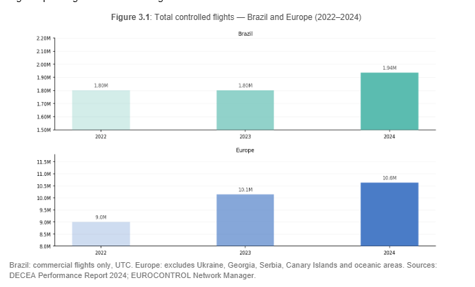
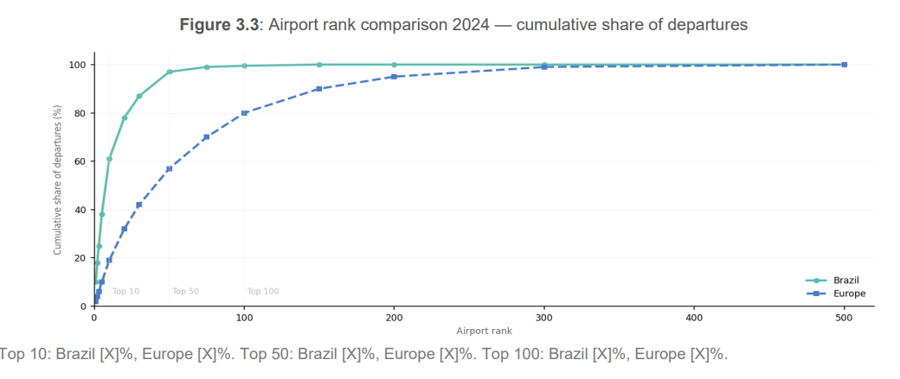
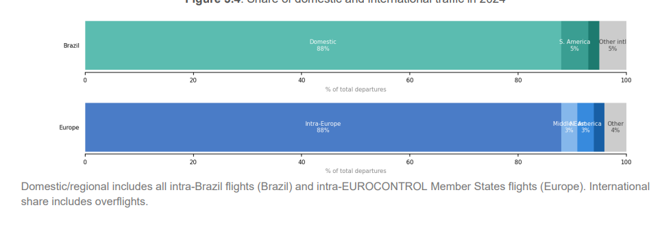
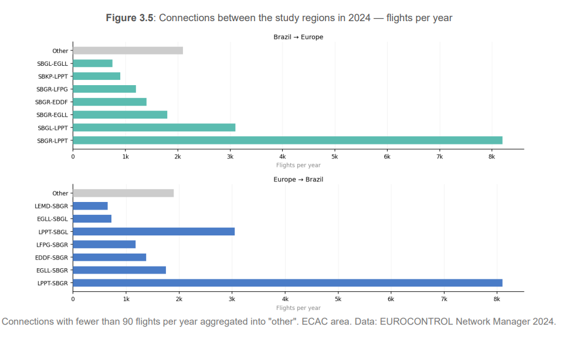
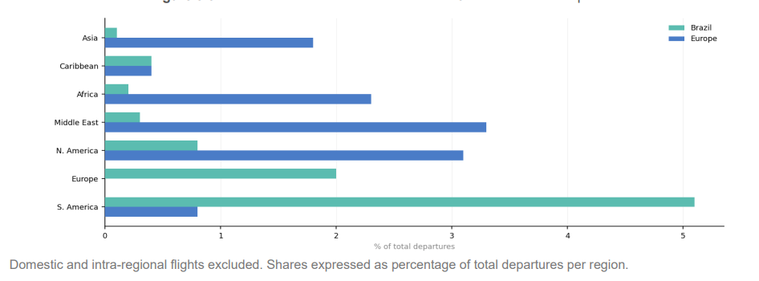
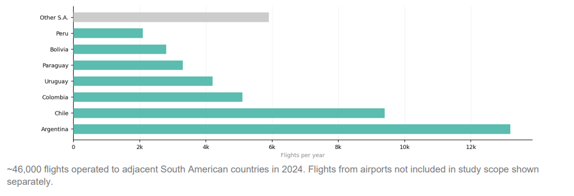

# Traffic Characterisation

```{r, echo=FALSE}
#| label: setup
#| echo: false
#| message: false

source(here::here("_chapter-setup.R"))
#source(here::here("R","03-traffic_characterization-graphs.R"))
```

To facilitate operational benchmarking comparisons, it is crucial to have a good understanding of the
level and composition of air traffic. This chapter presents air traffic characteristics for both regions,
structured progressively from a network-level overview to an airport-level assessment covering traffic
volumes, peak day demand, and fleet composition at the 12 study airports in each region.


## Network Characterisation


To address the changes in air traffic and develop a better understanding of the nature of the air
transportation network, this section characterises the network structure of both regions — progressing
from overall traffic volumes to the distribution within each region, the flows connecting Brazil and Europe,
and the broader international context.


### Overall Traffic Volume

In 2025, Brazil handled approximately [X] million controlled flights, representing approximately [X]% of the traffic serviced in Europe over the same period. Overflights account for a small share of the total in both regions. As shown in @fig-traffic-volume, both regions recorded growth over the 2023–2025 period, though the underlying dynamics differ significantly.
Brazil continued to expand its aviation sector, with traffic growing consistently across the three years — a trajectory that reflects sustained organic demand rather than cyclical fluctuation. In Europe, traffic levels also grew over the period, though at a more moderate pace, with the network continuing to consolidate. The different pace of growth across both regions reinforces the importance of understanding each system's structural context when comparing operational performance.


```{r}
#| label: fig-traffic-volume
#| fig-cap: "Overall traffic volume"
#| fig-align: "center"
#| out-width: 95%


```

```{r}

#| label: fig-annual-network
#| fig-cap: Evolution of annual network traffic
#| echo: false
#| warning: false
#| 
tmp_bra_yoy <-  arrow::read_parquet(here::here("data", "ndf_bra_totalbr_annually.parquet"))


# European data

# plug here


YEAR_COLORS <- c("2023" = "#E74C3C",   
                 "2024" = "#2ECC71",   
                 "2025" = "#5DADE2")   

plot_region_yoy <- function(data, title_label) {
  ggplot2::ggplot(data, ggplot2::aes(x = DOY, colour = YEAR)) +
      ggplot2::geom_line(
      ggplot2::aes(y = MVTS_ROLLAVG),
      linewidth = 0.7,
      na.rm     = TRUE        
) +
    ggplot2::scale_colour_manual(values = YEAR_COLORS) +
    ggplot2::scale_x_continuous(
          breaks = c(1, 32, 60, 91, 121, 152, 182, 213, 244, 274, 305, 335),
          labels = c("Jan","Feb","Mar","Apr","May","Jun",
                      "Jul","Aug","Sep","Oct","Nov","Dec")
    ) +
    ggplot2::scale_y_continuous(
      limits = c(0, NA),
      expand = ggplot2::expansion(mult = c(0, 0.05))
    ) +
    ggplot2::labs(
      title  = title_label,
      x      = NULL,
      y      = NULL,
      colour = NULL
    ) +
    ggplot2::theme_minimal(base_size = 11) +
    ggplot2::theme(
      plot.title       = ggplot2::element_text(hjust = 0.5, size = 11),
      panel.grid.minor = ggplot2::element_blank(),
      legend.position  = "bottom"
    )
}

# --- Panels ---

p_brazil_yoy <- plot_region_yoy(tmp_bra_yoy, "Brazil Region – Daily Movements by Year")


# p_europe_yoy <- plot_region_yoy(tmp_eur_yoy, "European Region – Daily Movements by Year")

p_brazil_yoy

# p_brazil_yoy / p_europe_yoy


```

@fig-annual-timeline shows the 7-day rolling average of daily movements in Brazil and Europe from 2019 to 2025. In Brazil, traffic levels recovered swiftly from the sharp drop observed in 2020 and have continued to grow steadily since 2022, surpassing 2019 levels and maintaining a stable profile with only modest seasonal variation throughout the year. The Brazilian air transport market does not exhibit strong seasonal peaks, reflecting a demand pattern driven primarily by domestic and regional connectivity rather than leisure-driven flows.
In the European region, the recovery trajectory is clearly visible — from the sharp collapse in 2020 through a gradual rebuilding of demand across 2021 and 2022, reaching and consolidating at 2019 levels by 2024 and 2025. Europe's traffic pattern, however, remains characterised by strong seasonal variation, with a pronounced surge in demand during the summer months that stands in clear contrast to the more stable Brazilian profile. This seasonal asymmetry is an important structural feature to bear in mind when comparing operational performance indicators across both regions throughout this report.

<!-- New version 2025 -->

```{r}

#| label: fig-annual-timeline
#| fig-cap: Regional daily air traffic
#| warning: false

## Read Brazil file after preparation from TOTALBR data.

tmp_bra <-  arrow::read_parquet(here::here("data", "ndf_bra_totalbr_daily.parquet"))

## Auxiliary function

plot_region <- function(data, color_raw, color_avg, title_label) {
  ggplot2::ggplot(data, aes(x = DATE)) +
    geom_point(
      aes(y = DLY_FLTS),
      color  = color_raw,
      alpha  = 0.2,
      size   = 0.3
    ) +
    geom_path(
      aes(y = MVTS_NORM_ROLLAVG),
      color     = color_avg,
      linewidth = 0.7
    ) +
    scale_y_continuous(
      limits = c(0, NA),          # Y começa em 0
      expand = expansion(mult = c(0, 0.05))
    ) +
    scale_x_date(
      date_breaks = "2 years",
      date_labels = "%Y"
    ) +
    labs(
      title = title_label,
      x     = NULL,
      y     = NULL
    ) +
    theme_minimal(base_size = 11) +
    theme(
      plot.title   = element_text(hjust = 0.5, size = 11),
      panel.grid.minor = element_blank()
    )
}

# --- Panels ---
p_brazil <- plot_region(
  data       = tmp_bra ,                  
  color_raw  = "#99cc99",             
  color_avg  = "#2e7d32",            
  title_label = "Brazil Region daily movement (rolling 7-day average)"
)
print(p_brazil) # meanwhile I don't have Europe data

# p_europe <- plot_region(
#   data       = tmp_eur,              # Europe data
#   color_raw  = "#90caf9",             
#   color_avg  = "#1565c0",             
#   title_label = "European Region daily movement (rolling 7-day average)"
# )
# 
# # --- Combine ---
# p_brazil / p_europe


```

### Traffic Distribution Within Each Region

While the total volume of traffic provides a first measure of the scale of operations in each region, it does not capture how that traffic is distributed across the network. @fig-traffic-share presents the cumulative share of departures by airport rank for both regions in 2025.
The distribution of air traffic in Brazil confirms that most flights are concentrated in a small number of airports. In 2025, the 10 busiest airports in Brazil handled [X]% of all departing flights, whereas in Europe the top 10 airports account for [X]% of all departures. The spread remains broadly constant up to the 50th rank, narrowing with the top 100 airports — marking [X]% of all departures in Brazil and [X]% in Europe. This reflects the historical development of the European network, where the traditional focus on national hubs resulted in a higher number of major aerodromes interconnecting across the continent.

```{r}
#| label: fig-traffic-share
#| fig-cap: "traffic share"
#| fig-align: "center"
#| out-width: 95%


```

@fig-traffic-distribution shows the distribution of domestic/regional and international departures in 2024. In both
regions, the share of flights operating externally accounts for less than [X]% of total traffic. The majority of
flights operate within each region. This domestic dominance is particularly pronounced in Brazil, where
the continental scale of the country sustains a large volume of intra-national movements. In Europe, the
relatively short distances between states mean that many flights classified as international are
functionally comparable to domestic short-haul routes in Brazil.

```{r}
#| label: fig-traffic-distribution
#| fig-cap: "traffic distribution"
#| fig-align: "center"
#| out-width: 95%


```


### Flows Between Brazil and Europe

@fig-flow shows the connections between Europe and Brazil in 2024. Individual connections with fewer
than 90 flights per year are aggregated into an "other" group. Traffic from Brazil to Europe accounts for
just under [X]% of the total traffic volume in Brazil. Guarulhos (SBGR) and Lisbon (LPPT) are the main
airports sustaining connectivity between both regions. Due to its prominent role as the primary gateway,
this edition considers operations at LPPT in a more prominent manner throughout the report


```{r}
#| label: fig-flow
#| fig-cap: "flow Brazil and Europe"
#| fig-align: "center"
#| out-width: 95%


```

### Connections to Other World Regions

From a broader international perspective, both regions are interconnected with the rest of the world in
distinct ways. @fig-share-regions shows the spread of international traffic from each region. For Brazil,
connections to other South American states represent the major international destinations. For Europe,
the Middle East, North America, and Africa represent the largest international markets, ranging between
[X]% and [X]% of all departures.


```{r}
#| label: fig-share-regions
#| fig-cap: "Connections to Others Regions"
#| fig-align: "center"
#| out-width: 95%


```


@fig-share-south-america provides a closer look at Brazil's regional connections, showing just under 46,000 flights
operated to adjacent countries in South America in 2024. Argentina and Chile together account for
approximately half of these movements, confirming the strength of the southern cone corridor. Flights to
Colombia and Uruguay represent a smaller fraction, complemented by a range of other connections
across South America and the Caribbean.


```{r}
#| label: fig-share-south-america
#| fig-cap: "Connections Brazil and South America"
#| fig-align: "center"
#| out-width: 95%


```

<!-- Old version 

@fig-annual-traffic-timeline shows the regional traffic development in Brazil and Europe for the period 2019 to 2024.
 
For Brazil, it is important to remember that @fig-annual-traffic-timeline shows the aggregated movements per airport at the whole network level.
The shown total does not necessarily reflect the total number of flights.
Another important observation related to the data is that Brazil’s number of airports served with the TATIC tool (Tower ATC System) has increased.
Despite raising the processed total daily flight number, this difference is mostly transparent for this study as these additional airports handle only a small number of movements on a day-to-day basis.


```{}
#| label: fig-annual-traffic-timeline1
#| fig-cap: Regional daily air traffic
#| warning: false

p_bra <- plot_annual_network_tfc(tfc_bra, bra_col) +
  labs(subtitle = "Brazil Region daily movement (rolling 7-day average)")
p_eur <- plot_annual_network_tfc(tfc_eur, eur_col) +
  labs(subtitle = "European Region daily movement (rolling 7-day average)")

p_bra / p_eur
```


Brazilian air traffic continues to exceed 2019 levels, marking a phase of real growth, not just post-pandemic recovery. Since 2022, traffic has grown steadily, showing a structured recovery in demand. However, commercial aviation is still adjusting its route network in some regions to fully match 2019 levels.

@fig-annual-traffic-timeline shows the daily evolution of air traffic in Brazil (7-day moving average) highlights the busiest and quietest periods of recent years. Over the past three years, the day with the lowest average traffic in Brazil typically falls on the Wednesday after Carnival. Meanwhile, the annual peak usually happens in late December, close to Christmas, reinforcing a well-established seasonal pattern in the Brazilian air transport market.
Overall, despite short-term fluctuations, the general trend is upward, confirming that Brazil is on a steady growth path. It is important to note that the Brazilian data only includes commercial flights (excluding general and military aviation) and is based on UTC time.

When we compare this with the European Region, a different dynamic becomes visible. In terms of total network-level air traffic, Europe still lags behind its pre-pandemic levels. However, if current trends continue, the region is expected to reach or slightly surpass 2019 traffic levels by 2025. Low-cost carriers have outperformed mainline airlines in the recovery phase. Their business model allowed for faster adjustments in staffing, crewing, and servicing. At the same time, national support programs for legacy carriers often included conditions such as slot restrictions or reduced domestic operations, which contributed to a decrease in overall network connectivity and frequency between airports.

-->

<!-- Old version 

```{}
#| label: fig-annual-network1
#| fig-cap: Evolution of annual network traffic1
#| echo: false
#| warning: false

this_years = c(2022,2023,2024)

# data loaded in supporting file - lift to here
# i.e. tfc_bra, tfc_eur

tfc_bra |> mutate(REG = "BRA") |> 
  bind_rows(tfc_eur) |> 
  
  # plot combined timelines
  plot_timeline_per_year(this_years) + 
  
  # beautify combined plot
  scale_y_continuous(limits = c(0,NA)) + 
  theme(legend.position = "inside", legend.position.inside = c(0.9, 0.6)) +
  facet_wrap(.~ REG, ncol = 1, scales = "free_y") 
```

-->


I stopped here.

## Airport Level Air Traffic

The previous section characterised the air traffic network at a macro level. As airports represent nodes in this overall network, changes to the overall traffic situation ripple down to the airport level. This demand on terminal and airport air navigation services forms a substantial input to understand how the operational performance measures in this report developed over time. This report looks at the performance levels observed at 12 key airports in each region.

@fig-eur-apt-level-tfc presents the airport-level traffic evolution for the study airports from 2023 to 2025. In Europe, airports have generally observed increases in movement levels across the period, reflecting a network in a phase of gradual consolidation. The Brazilian scenario is more heterogeneous — while some airports such as Galeão (SBGL) and Guarulhos (SBGR) registered increases, others such as Santos Dumont (SBRJ) and Porto Alegre (SBPA) saw declines in 2024. Meanwhile, Congonhas (SBSP) and Brasília (SBBR) showed very little variation overall. This divergence highlights the uneven pace of growth among Brazil's major airports, reflecting broader structural and operational differences in the national aviation landscape.


<!-- Old version

```{}
 #| label: fig-bra-apt-tfc1
 #| fig.cap: Brazilian airport level traffic1
 #| echo: false1
 
fig_bra_apt_tfc(c(2022,2023,2024))
```

```{}
#| label: fig-eur-apt-level-tfc1
#| fig-cap: European airport level traffic1
#| warning: false1
#| echo: false1

# TODO - move data loading to here

#annual_tfc_apt |> 
#  fig_eur_apt_tfc(.years = c(2022,2023,2024))

p_share <- annual_share_apts_network_eur |> 
  filter(YEAR %in% 2022:2024) |> 
  mutate(YEAR = as.character(YEAR)) |>
  p_share_of_network() + 
  scale_x_discrete(guide = guide_axis(n.dodge = 2))

p_col_annual <- annual_tfc_apt |> mutate(YEAR = as.character(YEAR)) |> get_p1_eur(c(2022,2023,2024))

# patch both plots
p_share + p_col_annual + plot_layout(widths = c(1, 4))
```

-->


<!-- new one -->

```{r}
#| label: fig-eur-apt-level-tfc
#| fig-cap: Airport level traffic
#| warning: false

bra_apt_share <- readr::read_csv(here::here("data", "bra_apt_lvl_traffic_share.csv")) |>
  dplyr::mutate(YEAR = factor(YEAR))

bra_total_share <- bra_apt_share |>
  dplyr::group_by(YEAR) |>
  dplyr::reframe(
    TOT_STUDY = sum(TOT_MOV_YEAR),
    TOT_ALL   = dplyr::first(TOT_MOV_ALL),
    SHARE     = TOT_STUDY / TOT_ALL * 100
  )
  

plot_apt_share <- function(apt_share, total_share, apts_names, title_label) {

  p_share <- ggplot2::ggplot(
      total_share,
      ggplot2::aes(x = YEAR, y = SHARE, group = 1)
    ) +
    ggplot2::geom_line(colour = "grey50", linewidth = 0.4) +
    ggplot2::geom_point(colour = "grey30", size = 2) +
    ggplot2::scale_y_continuous(
      limits = c(0, 100),
      labels = scales::label_percent(scale = 1, suffix = "%")
    ) +
    ggplot2::labs(x = NULL, y = NULL,
                  title = "share of overall\nnetwork traffic") +
    ggplot2::theme_minimal(base_size = 10) +
    ggplot2::theme(
      panel.grid.minor = ggplot2::element_blank(),
      plot.title       = ggplot2::element_text(size = 9, hjust = 0.5)
    )

  p_bars <- ggplot2::ggplot(
      apt_share |> dplyr::left_join(apts_names, by = "ICAO"),
      ggplot2::aes(x = NAME, y = TOT_MOV_YEAR, fill = YEAR)   # <-- x = NAME
  ) +
    ggplot2::geom_col(position = "dodge") +
    ggplot2::scale_fill_manual(values = YEAR_COLORS) +
    ggplot2::scale_y_continuous(
      limits = c(0, NA),
      expand = ggplot2::expansion(mult = c(0, 0.05)),
      labels = scales::label_comma()
    ) +
    ggplot2::labs(x = NULL, y = NULL, fill = NULL,
                  title = title_label) +
    ggplot2::theme_minimal(base_size = 10) +
    ggplot2::theme(
      panel.grid.minor = ggplot2::element_blank(),
      legend.position  = "top",
      axis.text.x      = ggplot2::element_text(angle = 45, hjust = 1)
    )

  (p_share | p_bars) +
    patchwork::plot_layout(widths = ggplot2::unit(c(3, 12), "cm"))
}

p_bra_share <- plot_apt_share(bra_apt_share, bra_total_share, bra_apts_names, "Brazil airport level traffic")
#p_eur <- plot_apt_share(eur_apt_share, eur_total_share, eur_apts_names, "European airport level traffic")

# p_bra / p_eur

p_bra_share
```


@fig-eur-apt-level-tfc presents the airport-level traffic evolution for the study airports from 2022 to 2024. The data clearly show different dynamics between the two regions. In Europe, all airports observed increases in movement levels from 2023 to 2024, reinforcing the region’s ongoing recovery trajectory.

The Brazilian scenario is more heterogeneous. While some airports, such as Galeão (SBGL) and Guarulhos (SBGR), registered increases, others—such as Santos Dumont (SBRJ) and Porto Alegre (SBPA) saw declines. Meanwhile, Congonhas (SBSP) and Brasília (SBBR) showed very little variation. This divergence highlights the uneven pace of recovery among Brazil’s major airports, reflecting broader structural and operational differences in the national aviation landscape.

It is also important to emphasize that Brazil’s air traffic is distributed across a much larger number of airports compared to Europe. As discussed in Chapter 2, Brazil’s extensive network dilutes traffic concentration at the top airports. This is illustrated on the left side of @fig-eur-apt-level-tfc, which shows a slight decline in the share of total traffic handled by Brazil. This suggests a modest redistribution of movements across a broader set of airports, potentially due to regional market recovery, strategic airline adjustments, or temporary infrastructure constraints—factors that will be discussed in the next sections.

Europe’s busiest airports have slightly increased their share of total network traffic over the same period. This upward trend reflects the growing reliance on major hubs as the region continues progressing toward pre-pandemic traffic levels, supported by more robust infrastructure and concentrated demand.

<!-- Old version

```{}
#| label: fig-apt-annual-change
#| fig-cap: Annual traffic at study airports in 2024 and variation 2024/2023
#| fig-pos: H

# Parâmetros: (ANO_REFERENCIA, ANO_COMPARACAO)
# TODO -- clean code - generalise and simplify
scale_limits <- c(-0.7, 0.8)

annual_change_bra(study_apt_lvl, 2024,2023,scale_limits) / annual_change_eur(annual_tfc_apt, 2024,2023,scale_limits)
```

-->


<!-- New version -->

```{r}

#| label: fig-apt-annual-change
#| fig-cap: Annual traffic at study airports in 2025 and variation 2025/2023
#| out-width: "70%"
#| fig-align: cente


mov_bra_study <- readr::read_csv(here::here("data" , "bra_mov_lvl_traffic.csv"))


plot_apt_bar_var <- function(data, apts_names, title_label) {
  
  # dados para barras — ano de referência
  d_bars <- data |>
    dplyr::filter(YEAR == this_year) |>
    dplyr::left_join(apts_names, by = "ICAO") |>
    dplyr::arrange(dplyr::desc(TOT_MOV_YEAR)) |>
    dplyr::mutate(NAME = factor(NAME, levels = NAME))

   d_var <- data |>
    dplyr::filter(YEAR %in% c(this_year - 1, this_year)) |>
    tidyr::pivot_wider(names_from = YEAR, values_from = TOT_MOV_YEAR,
                       names_prefix = "Y") |>
    dplyr::mutate(
      VAR_PCT = (.data[[paste0("Y", this_year)]] - 
                 .data[[paste0("Y", this_year - 1)]]) / 
                 .data[[paste0("Y", this_year - 1)]] * 100
    ) |>
    dplyr::left_join(apts_names, by = "ICAO") |>
    dplyr::mutate(
      NAME  = factor(NAME, levels = levels(d_bars$NAME)),
      COLOR = ifelse(VAR_PCT >= 0, "pos", "neg")
    )

    p_bars <- ggplot2::ggplot(
      d_bars,
      ggplot2::aes(y = NAME, x = TOT_MOV_YEAR)
    ) +
    ggplot2::geom_col(fill = "#2e7d32") +
    ggplot2::geom_text(
      ggplot2::aes(label = ICAO),
      hjust = 0, nudge_x = 1000, size = 2.5, colour = "grey40"
    ) +
    ggplot2::scale_x_continuous(
      labels = scales::label_comma(),
      expand = ggplot2::expansion(mult = c(0, 0.15))
    ) +
    ggplot2::labs(x = NULL, y = NULL, title = title_label) +
    ggplot2::theme_minimal(base_size = 10) +
    ggplot2::theme(
  panel.grid.minor = ggplot2::element_blank(),
  plot.margin      = ggplot2::margin(t = 5, r = 5, b = 5, l = 50)  # <-- l grande
)

 
  p_var <- ggplot2::ggplot(
      d_var,
      ggplot2::aes(y = NAME, x = VAR_PCT, fill = COLOR)
    ) +
    ggplot2::geom_col() +
    ggplot2::geom_vline(xintercept = 0, linewidth = 0.4, colour = "grey30") +
    ggplot2::scale_fill_manual(
      values = c("pos" = "#2ECC71", "neg" = "#E74C3C"),
      guide  = "none"
    ) +
    ggplot2::scale_x_continuous(
      labels = scales::label_percent(scale = 1, suffix = "%")
    ) +
    ggplot2::labs(
      x     = NULL,
      y     = NULL,
      title = glue::glue("var. {this_year}/{this_year - 1}")
    ) +
    ggplot2::theme_minimal(base_size = 10) +
    ggplot2::theme(
      panel.grid.minor = ggplot2::element_blank(),
      plot.margin      = ggplot2::margin(l = 20) ,
      axis.text.y      = ggplot2::element_blank()
    )

  (p_bars | p_var) +
    patchwork::plot_layout(widths = c(3, 1.5))
}

p_bra_var <- plot_apt_bar_var(mov_bra_study, bra_apts_names, "Brazil – Annual traffic")
#p_eur <- plot_apt_bar_var(mov_eur_study, eur_apts_names, "Europe – Annual traffic")

#p_bra / p_eur

p_bra_var


```

The 2024 air traffic analysis highlights the importance of understanding the structural differences between the Brazilian and European networks. While Guarulhos (SBGR) remains the busiest airport in Brazil, its traffic volume is comparable to that of the fifth and sixth busiest airports in Europe— Munich and Gatwick. 
This shows that direct comparisons between the top airports in each region may not fully reflect their operational realities. 
Factors such as the number of runways, network architecture, and traffic density create unique operational complexities in each case.


In Brazil, the largest traffic drop in 2024 occurred at Porto Alegre Airport (SBPA), which was directly impacted by major flooding in May and remained closed until October. Many flights were redirected to nearby airports in southern Brazil, which are not included in the scope of this comparison with Europe. Another change was the increase in traffic at Galeão International Airport (SBGL), which rose to sixth place among Brazil’s busiest airports. This shift was mainly driven by restrictions applied at Santos Dumont Airport (SBRJ), leading to a reallocation of flights from SBRJ to SBGL. As a result, SBRJ saw a decline, while SBGL experienced gradual growth in operations. This redistribution not only affects annual totals but will also have direct impacts on other indicators, such as the peak day of operations, which will be discussed later in this report.


The data illustrates how both the Brazilian and European air networks have adapted to their respective challenges. In Brazil, the system has shown resilience in the face of environmental events and regulatory changes, while in Europe, traffic growth is becoming more concentrated at major hubs as the region continues to recover toward pre-pandemic levels. These dynamics highlight the importance of continuous monitoring and flexible planning to ensure operational efficiency and network stability in both regions.


```{}
#| label: fig-monthly-tfc-sbgr-lppt
#| fig-cap: Monthly traffic evolution at SBGR, EDDM and SBSP, LPPT
#| fig-height: 6

p_sbgr_monthly_tfc <- month_tfc_bra |> airport_per_year("SBGR", 2023:2024)
p_sbsp_monthly_tfc <- month_tfc_bra |> airport_per_year("SBSP", 2023:2024)

p_eddm_monthly_tfc <- monthly_eddm |> airport_per_year(.apt = "EDDM", .years = 2023:2024)
p_lppt_monthly_tfc <- monthly_lppt |> airport_per_year(.apt = "LPPT", .years = 2023:2024)

combo1 <- p_sbgr_monthly_tfc + p_eddm_monthly_tfc +
  plot_layout(guides = "collect") &
  theme(legend.position = "top") &
  scale_y_continuous(limits = c(0, 31000)) & 
  scale_x_discrete(guide = guide_axis(n.dodge = 2))
  

combo2 <- 
  (p_sbsp_monthly_tfc + theme(legend.position = "none")) +
  (p_lppt_monthly_tfc + theme(legend.position = "none")) &
  scale_y_continuous(limits = c(0, 25000)) & 
  scale_x_discrete(guide = guide_axis(n.dodge = 2))

# combine combos
combo1 / combo2
```


@fig-monthly-tfc-sbgr-lppt shows the monthly evolution of traffic at Guarulhos International Airport (SBGR) during 2023 and 2024, which remains the top airport in Brazil, and Munich (EDDM).
EDDM recorded approximately 50,000 more operations than SBGR in 2025.
For SBGR, a steady increase in monthly operations can be seen throughout 2024 compared to 2023, with July standing out as the month with the highest volume during the period analysed. 
This trend reflects the continued strengthening of commercial aviation at Brazil’s main hub.
Operations at EDDM show a more pronounced seasonal pattern with traffic building up from end Spring to the peak levels during the summer months including October.
Comparing traffic levels in 2023 with 2024, EDDM shows also a strong increase in demand as part of the on-going pandemic recovery. 

Comparing operations at Sao Paulo Congonhas (SBSP) and Lisbon (LPPT) shows again a more seasonal pattern in Europe with the summer period representing the peak months. 
Traffic evolution at SBSP is more moderated. There exists variation across the year in comparison to 2023 suggesting slight modifications of the schedule. However, on average, traffic levels appear stable at SBSP servicing predominantly national and regional traffic.
Lisbon (LPPT) showed also smaller variations when comparing traffic levels in 2023 vs 2024. 
This suggests that air transport demand has stabilised post-pandemic. 
It also evidences that the level of air transport recovery across Europe varies.

Guarulhos’ performance becomes more relevant when compared to the busiest airports in Europe. 
Similar traffic levels were observed at Munich (EDDM) in Europe in 2024 highlighting the different realities of each region. 
This comparison helps illustrate the structural complexity and differences between the two systems. 
While Brazil concentrates much of its traffic in a number of key airports like SBGR, Europe sees a more varied spread of operations across a larger network of major airports. 
The group of latter airports often operate a more robust infrastructure (such as more runways). 
Therefore, a direct comparisons between the “top” airports in each region may not accurately reflect their unique operational contexts.


## Peak Day Traffic

While the annual traffic provides insights in the total air traffic volume and the associated demand, it does not provide insights on the upper bound of achievable daily movement numbers.
The latter depends on demand, operational procedures and/or associated constraints, and the use of the runway system infrastructure.
The peak day traffic is determined as the 99th percentile of the total number of daily movements (arrivals and departures).
The measure represents thus an upper bound for comparison purposes.

```{r}
#| label: fig-peak-day-3years
#| fig-cap: Airport peak daily traffic (2023 - 2025)
#| message: false
#| warning: false

peak_day_from_counts <- function(.counts, .pct = 0.99){
  .counts |> 
    mutate(
      YEAR = lubridate::year(DATE),
      TOT  = ARRS + DEPS
    ) |> 
    group_by(ICAO, YEAR) |> 
    summarise(PEAK_DAY_PCT = quantile(TOT, probs = .pct), .groups = "drop")
}

add_nbr_rwy <- function(.pdfc){
  .pdfc |> 
    mutate(RWY = case_when(
       ICAO %in% c("EHAM") ~ 6
      ,ICAO %in% c("LTFM") ~ 5
      ,ICAO %in% c("EDDF","LFPG","LEMD","LIRF") ~ 4
      ,ICAO %in% c("LEBL","LSZH") ~ 3
      ,ICAO %in% c("EGLL","EDDM","LGAV"
                   ,"SBGR","SBSP","SBGL","SBBR","SBRJ","SBSV","SBCT") ~ 2
      ,ICAO %in% c("EGKK","LPPT"
                   ,"SBKP","SBCF","SBPA","SBRF","SBEG") ~ 1
      ,TRUE ~ as.numeric(NA)
    ))
}

pk_day_plot <- function(.pk_day_data, .years){
  .pk_day_data |> 
    filter(YEAR %in% .years) |> 
    ggplot() + 
    geom_col(
      aes(y = ICAO, x = PEAK_DAY_PCT, fill = as.factor(YEAR)),
      position = position_dodge2(preserve = "single")
    )
}

plot_peak_day_tfc <- function(.df, .year){
  .df |> 
    filter(YEAR == .year) |> 
    ggplot(aes(x = PEAK_DAY_PCT, y = reorder(NAME, PEAK_DAY_PCT))) + 
    geom_col(aes(fill = REGION)) +
    geom_text(aes(x = 20, label = ICAO), hjust = 0, color = "white", size = 3) +
    scale_fill_manual(values = bra_eur_colours) + 
    facet_grid(RWY ~ ., as.table = FALSE, switch = "y", scales = "free", space = "free") +
    labs(y = NULL, fill = "Region") +
    theme(
      legend.position = c(0.9, 0.15),
      axis.ticks = element_blank()
    )
}

tfc_apts_bra <- readr::read_delim(
  here::here("data", "Movements-Brazil-2023-2024-2025-raw.csv"),
  delim = ";",
  locale = readr::locale(encoding = "UTF-8"),
  show_col_types = FALSE
) |> 
  transmute(
    ICAO = SG_ORGAO,
    DATE = lubridate::dmy(DATA_INICIO_BRT),
    ARRS = TOTAL,
    DEPS = 0
  ) |> 
  filter(ICAO %in% bra_apts) |> 
  summarise(ARRS = sum(ARRS), DEPS = sum(DEPS), .by = c(ICAO, DATE))

tfc_apts_eur <- bind_rows(
  readr::read_csv(here::here("data", "EUR-apt-tfc-2019-2024.csv"), show_col_types = FALSE),
  readr::read_csv(here::here("data", "EUR-apt-tfc-2025.csv"), show_col_types = FALSE)
) |> 
  filter(ICAO %in% eur_apts)

peak_day_bra <- tfc_apts_bra |> 
  peak_day_from_counts() |> 
  add_nbr_rwy() |> 
  mutate(REGION = "BRA")

peak_day_eur <- tfc_apts_eur |> 
  peak_day_from_counts() |> 
  add_nbr_rwy() |> 
  mutate(REGION = "EUR")

peak_day_comb <- bind_rows(peak_day_bra, peak_day_eur)

peak_day_comb |> 
  pk_day_plot(2023:2025) +
  facet_wrap(. ~ REGION, scales = "free_y") +
  labs(fill = element_blank(), x = element_blank(),  y = element_blank()) +
  theme(
    legend.position = "inside",
    legend.position.inside = c(0.95, 0.95),
    legend.key.size = unit(3, "mm")
  )
```

@fig-peak-day-3years shows the evolution of peak day traffic between 2023 and 2025 across the Brazilian and European airports included in this study.
The peak day measurement is as a useful complement to traffic levels and average daily movement metrics.
It provides a reference to the achievable daily service rate that can highlight nuances of the operational context and constraints at comparable airports and approach areas.

Overall, the data shows a more differentiated development of operational volumes across the Brazilian study airports. 
On the European side, the year-by-year comparison highlights the on-going recovery and first consolidation effects post the pandemic. 
Consistent with the overall traffic increase, most European airports recorded an increase in peak day traffic between 2024 and 2025, while a number of the largest airports show only marginal changes that point to daily service rates already close to their current upper operating range.

Still, some variations stand out on the Brazilian side:

* Guarulhos (SBGR), Galeão (SBGL), and Brasília (SBBR) recorded increases in their peak day movements, reflecting their greater capacity to absorb traffic and some redistribution of demand within the national network.

* Congonhas (SBSP), on the other hand, shows a notable drop in 2025, while Santos Dumont (SBRJ) remains well below its 2023 peak day value following the operational restrictions implemented during 2024, which limited its capacity and led to the transfer of some flights to SBGL.

* In the case of Porto Alegre (SBPA), even though it was severely affected by floods starting in May 2024, the data shows only a limited recovery in its 2025 peak day value and remains below the level observed in 2023.

Regarding the peak day traffic at European airports:

* Istanbul (LTFM) shows the highest peak day traffic among the European study airports in 2025 and continues to increase compared to the previous years.

* Significant increases are observed at Frankfurt (EDDF), Munich (EDDM), Athens (LGAV), Barcelona (LEBL), and Madrid (LEMD) over the 2023 to 2025 period. As major gateways, this also reflects the increase in international air traffic and the continued strengthening of network connections by the major carriers operating from/to these airports.

* Marginal to no changes between 2024 and 2025 evidence that the peak operations at Paris Charles de Gaulle (LFPG), London Heathrow (EGLL), Amsterdam (EHAM), and Lisbon (LPPT) reach their daily maximum service rate. 

The comparison between the Brazilian and European contexts reinforces the importance of considering each network's structure, operational model, and geographic distribution when evaluating operational performance at and around airports. 
It also shows how peak day traffic can offer unique insights — especially during periods of recovery or transition — by highlighting the maximum operational load airport services can sustain regardless of their average daily traffic.

```{r}
#| label: fig-peak-day
#| fig-cap: Airport peak daily service rate (99th percentile, 2025)
#| message: false

peak_day_comb |> 
  #------- add nice airport names
  left_join( bra_apts_names |> bind_rows(eur_apts_names)
           , by = join_by(ICAO) ) |> 
  
  plot_peak_day_tfc(2025) +
  labs(x = element_blank())
```

Analysing the 2025 peak day data, as presented in @fig-peak-day, with Brazilian and European airports grouped by number of runways, we observe that seven European airports operate with three or more runways and are therefore not directly comparable to Brazilian airports. 
However, it is important to note that in many of these cases, the runway system does not support fully independent operations on all available runways.
Such constraints reduce the available runway system capacity, and thus, the serviced peak traffic is also impacted by the runway system configuration.
For example, operations at Amsterdam (EHAM) cannot make use of all six runways at the same time.
Operations at Zurich (LSZH, 3 interdependent runway system) range above the order of single runway operations at Lisbon (LPPT, 1 runway). 
As a result, peak traffic performance is also shaped by the specific runway configuration.

When focusing on airports with up to two runways, European airports still generally show higher peak day movements compared to the Brazilian ones. 
This difference can be attributed to more robust infrastructure and operational systems in Europe.
Additional benefits are exploited by dedicated operational concepts. 
For example, London Heathrow implemented time-based separation on final which adds to achieving a high level of runway system throughput even in high wind situations.

This shows the importance of analysing peak day traffic as a complementary indicator to average daily movements, especially during periods of recovery or operational adjustments.
Future research may highlight the impact of the runway system configuration on the service rate under the associated runway use.

## Fleet Mix

```{r}
#| label: fig-fleet-mix
#| fig-cap: Fleet mix observed at the study airports in 2025
#| fig-height: 5
#| message: false
#| warning: false

fleet_mix_from_counts <- function(.counts, .reg){
  fm <- .counts |> 
    mutate(
      YEAR = lubridate::year(DATE)
     ,TOT  = H + M + L
    ) |> 
    group_by(ICAO, YEAR) |> 
    summarise(
       TOT    = sum(TOT, na.rm = TRUE)
      ,H_PERC = sum(H, na.rm = TRUE) / TOT
      ,M_PERC = sum(M, na.rm = TRUE) / TOT
      ,L_PERC = sum(L, na.rm = TRUE) / TOT
      ,.groups = "drop"
    ) |> 
    mutate(REGION = .reg) |>
    tidyr::pivot_longer(
       cols      = c(H_PERC, M_PERC, L_PERC)
      ,names_to  = "WTC"
      ,values_to = "SHARE"
    ) |>
    mutate(
      WTC = factor(
         WTC
        ,levels = c("L_PERC", "M_PERC", "H_PERC")
        ,labels = c("Light", "Medium", "Heavy")
      )
    )
}

plot_fleet_mix <- function(.fleetmix_airports, .key_year){
  fleet_mix_plot <- 
    ggplot2::ggplot( 
       data    = .fleetmix_airports |> dplyr::filter(YEAR == .key_year)
      ,mapping = ggplot2::aes(y = paste(ICAO, NAME), x = SHARE, fill = WTC)
    ) +
    ggplot2::geom_col(position = "stack", width = 0.9)  +
    ggplot2::scale_fill_manual(values = c("#56B4E9", "#009E73", "#F0E442")) +
    ggplot2::scale_y_discrete(labels = scales::label_wrap(10)) +
    ggplot2::scale_x_continuous(labels = scales::percent) +
    ggplot2::facet_wrap(. ~ REGION, scales = "free_y") + 
    ggplot2::theme(
       legend.position = "top"
      ,legend.title    = ggplot2::element_text(size = 8) 
      ,legend.text     = ggplot2::element_text(size = 8)
      ,legend.key.size = ggplot2::unit(0.3, "cm")
    ) +
    ggplot2::labs(x = NULL, y = NULL)

  return(fleet_mix_plot)
}

tfc_apts_bra <- readr::read_csv(
  here::here("data", "BRA-apt-tfc-2023-2025.csv"),
  show_col_types = FALSE
) |> 
  dplyr::filter(ICAO %in% bra_apts)

tfc_apts_eur <- dplyr::bind_rows(
  readr::read_csv(here::here("data", "EUR-apt-tfc-2019-2024.csv"), show_col_types = FALSE),
  readr::read_csv(here::here("data", "EUR-apt-tfc-2025.csv"), show_col_types = FALSE)
) |> 
  dplyr::filter(ICAO %in% eur_apts)

fm_apts_bra <- tfc_apts_bra |> 
  fleet_mix_from_counts("BRA")

fm_apts_eur <- tfc_apts_eur |>
  fleet_mix_from_counts("EUR")

fm_apts <- dplyr::bind_rows(fm_apts_bra, fm_apts_eur) |> 
  left_join(bind_rows(bra_apts_names, eur_apts_names), by = join_by(ICAO))

key_year <- 2025

plot_fleet_mix(fm_apts, key_year)
```

@fig-fleet-mix confirms the dominance of the “medium” aircraft category at the airports analysed in both Brazil and Europe. 
Fleet mix plays a key role in airport capacity, directly impacting traffic flow and operational efficiency. 
Generally, a higher share of “heavy” aircraft can reduce runway throughput due to wake turbulence separation requirements and longer landing and take-off times.

In Brazil, the main international hubs, Guarulhos (SBGR), Galeão (SBGL), and Campinas (SBKP), show the highest share of “heavy” aircraft among the Brazilian study airports, reinforcing their role as the country’s key international gateways. 
Guarulhos remains the strongest Brazilian heavy-aircraft profile, while Galeão and Campinas continue to combine international, domestic, and cargo-related operations, contributing to a more diverse fleet profile and operational complexity.

Some Brazilian airports such as Brasília (SBBR) and Salvador (SBSV) serviced a significant share of “light” aircraft.
This category that is nearly absent among the European airports analysed.
The notable exemption is Zurich (LSZH). 
In Salvador, light aircraft account for about one fifth of all movements, while the share is even higher at Eduardo Gomes (SBEG), reflecting the specific regional and logistical roles of these airports.

On average, the share of "heavy" aircraft remains higher at the European study airports.
The major European hubs like Heathrow (EGLL), Charles de Gaulle (LFPG), Istanbul (LTFM), and Frankfurt (EDDF) operate with a higher proportion of “heavy” aircraft, in line with their function as global connection points. 
These structural differences reflect how each region organizes its connectivity: Brazil tends to centralize long-haul operations in a few key airports.
The European network evidences the national focus on air transport development. 
With a significant higher number across a broader set of hubs traditionally servicing the national capitals.

Based on continuous monitoring throughout the year, this pattern has proven to be remarkably stable. 
The distribution of aircraft categories has remained consistent even during periods of disruption, such as extreme weather or localized infrastructure constraints. 
These observations suggest that the fleet mix at the analysed airports is shaped more by long-term structural factors than by short-term fluctuations, as airspace users operate and renew their fleet servicing these airports within their economic and operational context.

```{r}
#| label: fig-fleetmix-evolution
#| fig-cap: Change in heavy and light aircraft share at the study airports (2023 and 2025)
#| fig-height: 5
#| message: false
#| warning: false

plot_fleetmix_shift <- function(.fleetmix){
  fleetmix_xy <- .fleetmix |>
    dplyr::filter(YEAR %in% c(2023, 2025), WTC %in% c("Heavy", "Light")) |>
    dplyr::select(REGION, ICAO, NAME, YEAR, WTC, SHARE) |>
    tidyr::pivot_wider(names_from = WTC, values_from = SHARE)

  fleetmix_shift <- fleetmix_xy |>
    tidyr::pivot_wider(
       names_from  = YEAR
      ,values_from = c(Heavy, Light)
      ,names_prefix = "Y"
    ) |>
    dplyr::filter(
      !is.na(Heavy_Y2023), !is.na(Heavy_Y2025),
      !is.na(Light_Y2023), !is.na(Light_Y2025)
    )

  fleetmix_labels <- fleetmix_xy |>
    dplyr::filter(YEAR == 2025)

  ggplot2::ggplot() +
    ggplot2::geom_segment(
       data = fleetmix_shift
      ,mapping = ggplot2::aes(
         x = Heavy_Y2023, y = Light_Y2023,
         xend = Heavy_Y2025, yend = Light_Y2025
       )
      ,arrow = ggplot2::arrow(length = ggplot2::unit(0.12, "inches"))
      ,linewidth = 0.35
      ,colour = "grey45"
    ) +
    ggplot2::geom_point(
       data = fleetmix_xy
      ,mapping = ggplot2::aes(x = Heavy, y = Light, shape = factor(YEAR))
      ,size = 2.1
      ,colour = "black"
      ,fill = "white"
    ) +
    ggrepel::geom_text_repel(
       data = fleetmix_labels
      ,mapping = ggplot2::aes(x = Heavy, y = Light, label = ICAO)
      ,size = 2.7
      ,min.segment.length = 0
      ,seed = 11
      ,show.legend = FALSE
    ) +
    ggplot2::facet_wrap(. ~ REGION) +
    ggplot2::scale_x_continuous(labels = scales::percent, limits = c(0, NA)) +
    ggplot2::scale_y_continuous(labels = scales::percent, limits = c(0, NA)) +
    ggplot2::scale_shape_manual(values = c("2023" = 1, "2025" = 16)) +
    ggplot2::theme(
       legend.position = "top"
      ,legend.title = ggplot2::element_blank()
      ,panel.grid.minor = ggplot2::element_blank()
    ) +
    ggplot2::labs(
       x = "share of heavy aircraft"
      ,y = "share of light aircraft"
    )
}

plot_fleetmix_shift(fm_apts)
```

@fig-fleetmix-evolution provides a complementary view of this structural difference by focusing on the two categories that create the clearest contrast between the regions. 
Between 2023 and 2025, the European airports remain clustered along a high-heavy, very-low-light profile, with Heathrow (EGLL), Paris Charles de Gaulle (LFPG), Frankfurt (EDDF), Istanbul (LTFM), and Madrid (LEMD) maintaining the strongest heavy-aircraft component.
In Brazil, the spread is wider: Guarulhos (SBGR), Galeão (SBGL), and Campinas (SBKP) continue to anchor the heavier end of the Brazilian group, while Eduardo Gomes (SBEG), Salvador (SBSV), Brasília (SBBR), Porto Alegre (SBPA), and Curitiba (SBCT) retain a visibly higher light-aircraft component.
The 2023 to 2025 movement therefore reinforces the interpretation that the difference is structural rather than a temporary annual fluctuation, even as local changes are visible at airports affected by network adjustments and demand recovery.

<!-- REMOVED FOR 2024 report --- FLEETMIX TIMELINE ~ FAIRLY STABLE -------------
#| label: fig-fleetmix-timeline
#| fig-cap: Fleet mix change over time observed at study airports
#| fig-height: 6

fleet_mix_timeline(c(2019:2024))

On average, @ fig-fleetmix-timeline shows that the fleetmix remained fairly stable over the years.
It is interesting to observe that the unprecedented decline in air transport during the pandemic phase did not substantially break this pattern.
This suggests that the contraction of the traffic volume hit all segments at a similar rate [^03-traffic_characterisation-1].

[^03-traffic_characterisation-1]: It must be noted that conceptually, the number of aircraft remained unchanged in the both regions.
    The higher utilisation of "heavy" aircraft for logistical support appeared to have offset the lower number international / long-haul passenger flights.
    For the first six month of 2023, this pattern is continued
    
-------------------------------------------------------------- -->

<!-- FUTURE RESEARCH -----------------------------------------------
What can we say about the "medium" types (which models, seat capacity) and frequency of operations?
What are the light types used for / from/to where do they operate?

----------------------------------------------------------------- -->

## Summary

This chapter provided a comprehensive overview of air traffic dynamics across Brazil and Europe, covering both network-wide and airport-level perspectives.

The data confirms that Brazilian air traffic has surpassed pre-pandemic levels, reflecting a phase of real growth, while Europe continues a gradual recovery, marked by strong seasonal peaks and a more fragmented network structure. 
If current trends persist, Europe is expected to return to pre-pandemic traffic levels by 2025/2026, particularly driven by robust summer activity and the continued normalisation of regional and international demand. 
Despite these differences, both regions show signs of stability and resilience, even when affected by disruptions such as extreme weather or regulatory adjustments.
Events like the prolonged closure of Porto Alegre (SBPA) and restrictions at Santos Dumont (SBRJ) highlighted the sensitivity of localized operations and the capacity of the network to adapt.

At the airport level, Brazilian traffic remains highly concentrated in a few major hubs, whereas European operations are more spread across several national gateways. 
There is a more pronounced seasonal pattern in Europe typically culminating during the summer holiday season.

The peak day analysis complemented the annual view by illustrating the operational limits reached under maximum demand. 
Although volumes remained stable overall, individual airports showed notable variations—either from growth, as in SBGL and SBCF, or contraction, as seen in SBRJ.
European peak service rates show the overall recovery pattern and first signs of reaching the available capacity for the major hubs.  

Finally, the fleet mix analysis reinforced the structural differences in how each region operates: Brazil shows a higher presence of light aircraft in some regional airports and a centralised model for long-haul traffic.
Light-type traffic at the study airports in Europe remain the exemption.
A higher share of heavy aircraft is observed at the top-European airport in this study.
The wider spread of international connections across all chosen airports shows a less centralised global connectivity model.

Together, these findings establish a base to understanding the operational performance indicators in the next chapters.
