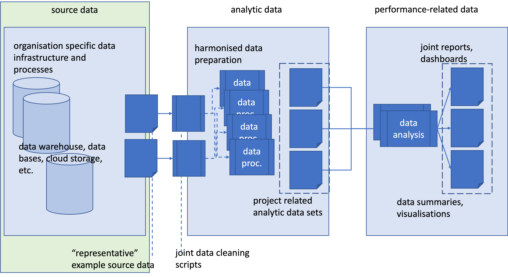

## Basics

This document serves as an aide memoire to guide the production of the BRA-EUR report.

:::{.callout-tip}
## General design criteria

* the report is built using quarto and the R-ecosystem, the final output in form of a pdf version and accompanying html (quarto) book
* assciated chapters are managed / included via _quarto.yml, supporting and releasable documents are provided (e.g. this aide-memoire)
* reserved folders
  + figures -- keeps all embedded figures (e.g. maps), if required "tailored" figures may be composed using powerpoint (and save as): __figures-handmade.pptx
  + R -- all R functions (once steady and industrialised)
  + data -- the data to reproduce (and render) the report, ideally in (harmonised) PBWG format
  + docs -- reserved, this folder is used for the hosting of the html report on github
  + (gitignored) _book-local -- to support local rendering of contributors
:::

This report is produced by various individuals with different programming backgrounds.
The following coding style shall serve to increase the readability of code and its review/troubleshooting.    
Some of the work may be outsourced to another project aiming at producing a supporting R-package.

:::{.callout-note}
## Coding principles

* the principle paradigm is i.) read (analytic or performance-related) data, ii.) process and prepare the data for the analysis at hand, and iii.) "communicate" (either as table or visualisation) the results
* these steps shall be performed starting from the agreed harmonised "PBWG" format or a proposed version (if trialled first in BRA-EUR)
* associated functions shall be **generic**, i.e., not building on specifics of the regional data
* specific folders -- c.f. above
* the report and supporting repo will be "public" - use .gitignore 
* gitignore "large" source data/files to avoid issues with github,      
  share the files via joint folders/file transfer
* coding style
  + variables and function-names: lower-case with underscore, e.g. asmas, calc_travel_time     
    try to name what it is or does, e.g. taxi-in times: txits, ggplot function: plot_fancy_thing
  + dataframe/tibble: column-names upper-case for all standard aviation terms, e.g. actual taxi-in time: TXIT, use underscore prefix/postfix, e.g. TOT_TXIT
  + quarto tags: use hyphen, e.g. fig-cool-plot, sec-herehappenssomething
  + file names: use hyphen
  
:::


## Overall Data Flow/Process

Both groups process and expose their data in different systems and technologies.     
While an open exchange of the underlying **source data** is a means to continue with the harmonisation of the data processes, the goal is to arrive at a set of harmonised (PBWG) data sets for the common indicators.    
Accordingly, the source data extraction may differ between the parties, e.g. Brazil/DECEA is developing endpoints for API queries, ECTRL/PRU is limited by the on-going cloud transition and currently access their data via a classical data warehouse/SQL.

The BRA-EUR report builds on the PBWG work and will propose changes to the latter during further developments.

```{r}
#| out-width: 100%

```

The report broadly distinguishes between network-level and airport-level reporting.

## Network-level Data

## Airport-level Data

### APDF - Airport Data Flow

The APDF format represents a compact airport-level format from which the common GANP indicators can be calculated, including variants.   
The ADPF data sets ensure also a decent basis for the on-going developments.

TODO - describe format