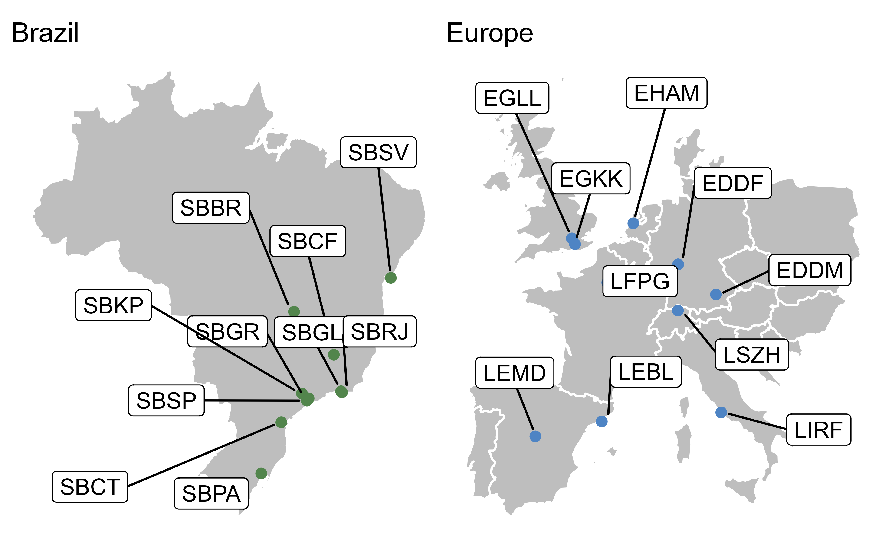
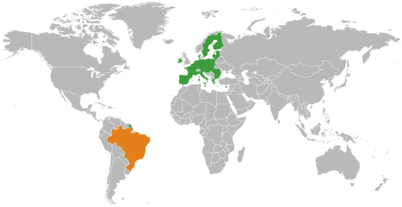

This is my great text and code that I have developed.
This is another beautiful invention from Rainer and Bene.

@fig-scope-airports we see something beautiful

```{r}
#| label: fig-scope-airports
#| fig-cap: Study airports of Brazil/Europe Comparison

#| out-width: 90%
#| 

```

our new BRA-EUR chart view is presented next in @fig-test.

```{r}
#| label: fig-test

```

```{r}
bra_taxi <- 0.7
```

The annual taxi-times in Brazil are `r bra_taxi`.


my analysis gives me the following result

```{r}
#| label: pythogora
#| echo: fenced
a <- 7
b <- 10
# Pythagoras' equation: c "square" = a square + b square
c_square <- a^2 + b^2
c <- sqrt(c_square)
#c
c_round <- round(c, digits = 2)
```

my analysis gives me the following result `r c_round`

this dataset has many observations:

```{r}
rainer <- read.csv("./data/xx-demo.csv")
nrow(rainer)
```

